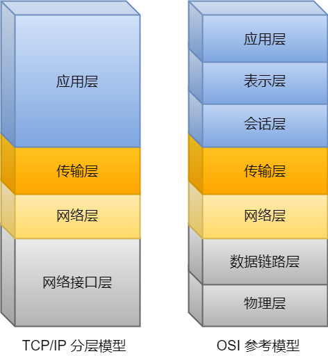
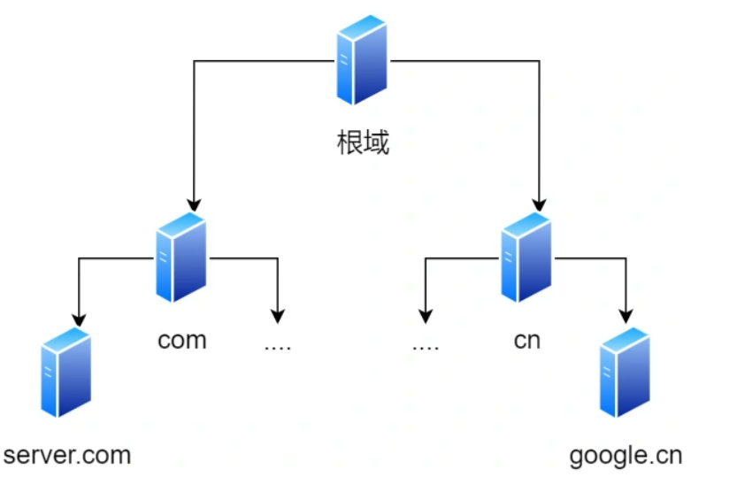
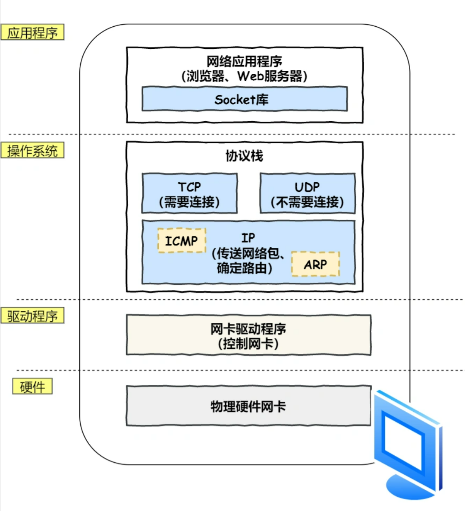

# Frame： 从输入网址到显示网页内容， 期间的过程

## 流程

1. **输入网址(URL)**

   根据URL获取服务器域名和服务器上的资源， 根据这些生成数据包。

2. **目的地——DNS服务器解析服务器域名成IP， 接受目标**。

  DNS服务器可以根据域名解析成网络IP， 用于定位数据包发送的目的地址。

3. **建立友谊——TCP三次握手**

  建立浏览器和服务器的连接，通过TCP三次握手

4. **下一站——MAC地址**

  在知道最终目的地后，但不知道具体的走哪条路（下一站）， 便广播`ARP`协议报文，在子网内询问IP地址对应的Mac地址

5. **启程——网卡**

  知道下一站后，就开始寻路了。 在网卡的控制下， 将数字信号转化为电信号通过网线传输。

6. **指路者——交换机**

  电信号到达网络接口，交换机进行接收，转换成数字信号。解析并通过`FCS`校验后，放入缓冲区，查询Mac地址表找网络对应端口发送。

7. **出境大门——路由器**

  数据包经过交换机到达路由器。查询路由表中IP对应的**下一站对应的Mac地址**，继续转发。

8. **到啦！——服务器接收**

  服务器接收到HTTP请求后，解析数据包， 去除MAC,IP，TCP头部，获取HTTP数据，回复HTTP响应报文。

9. **收到啦！——浏览器接收**

  浏览器接收到HTTP响应报文。

10. **显示**

  浏览器读取内容， 解析HTML，生成DOM树，解析CSS，处理JS交互，浏览器和客户端交互。

11. **再见！——四次挥手，断开TCP连接**

## 网络构成模型

## 细节部分

### DNS查询

域名是由`.`来区分的， 如`www.google.com`。 因此， 域名也是分层的，对应不同的DNS服务器，一层一层询问，直到查询到IP。

**域名的层级关系类似一个树状结构**：

- 根 DNS 服务器（.）
- 顶级域 DNS 服务器（.com）
- 权威 DNS 服务器（google.com）

当然， 查询DNS服务器之前，会查询缓存。

**浏览器缓存 --> 操作系统缓存 --> hosts文件 --> DNS服务器**。

### 协议栈

通过 DNS 获取到 IP 后，就可以把 HTTP 的传输工作交给操作系统中的**协议栈**。

协议栈的内部分为几个部分，分别承担不同的工作。上下关系是有一定的规则的，上面的部分会向下面的部分委托工作，下面的部分收到委托的工作并执行。

应用程序（浏览器）通过调用 Socket 库，来委托协议栈工作。协议栈的上半部分有两块，分别是负责收发数据的 TCP 和 UDP 协议，这两个传输协议会接受应用层的委托执行收发数据的操作。

协议栈的下面一半是用 IP 协议控制网络包收发操作，在互联网上传数据时，数据会被切分成一块块的网络包，而将网络包发送给对方的操作就是由 IP 负责的。

此外 IP 中还包括 `ICMP` 协议和 `ARP` 协议。

- `ICMP` 用于告知网络包传送过程中产生的错误以及各种控制信息。
- `ARP` 用于根据 IP 地址查询相应的以太网 MAC 地址。

IP 下面的网卡驱动程序负责控制网卡硬件，而最下面的网卡则负责完成实际的收发操作，也就是对网线中的信号执行发送和接收操作。

**HTTP基于TCP协议传输。**

### Mac地址

类似DNS查询IP，获取Mac地址时， 操作系统会把ARP查询结果缓存。

MAC 地址在以太网内进行**两个设备**之间的包传输。转发的过程中，源IP地址和目标IP地址是不会变的，源MAC地址和目标MAC地址是会变化的。