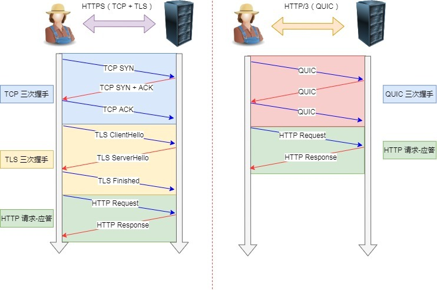

# Http

Hyper Text Transfer Protocol: 超文本传输协议

**超文本**：富含文字，图片，视频，超链接等的混合文本。

## 常见状态码

**`2xx`表示服务器成功处理了客户端请求**。

* 「**200 OK**」是最常见的成功状态码，表示一切正常。如果是非 `HEAD` 请求，服务器返回的响应头都会有 body 数据。
* 「**204 No Content**」也是常见的成功状态码，与 200 OK 基本相同，但响应头没有 body 数据。
* 「**206 Partial Content**」是应用于 HTTP 分块下载或断点续传，表示响应返回的 body 数据并不是资源的全部，而是其中的一部分，也是服务器处理成功的状态。

**`3xx`表示请求的资源发生变动，需要使用新的URL请求。也就是「重定向**」。

- 「**301 Moved Permanently**」表示永久重定向，说明请求的资源已经不存在了，需改用新的 URL 再次访问。
- 「**302 Found**」表示临时重定向，说明请求的资源还在，但暂时需要用另一个 URL 来访问。

​		301 和 302 都会在响应头里使用字段 `Location`，指明后续要跳转的 URL，浏览器会自动重定向新的 URL。

* 「**304 Not Modified**」不具有跳转的含义，表示资源未修改，重定向已存在的缓冲文件，也称缓存重定向，也就是告诉客户端可以继续使用缓存资源，用于缓存控制。

**`4xx` 类状态码表示客户端发送的报文有误，服务器无法处理，也就是错误码的含义**。

- 「**400 Bad Request**」表示客户端请求的报文有错误，但只是个笼统的错误。
- 「**403 Forbidden**」表示服务器禁止访问资源，并不是客户端的请求出错。
- 「**404 Not Found**」表示请求的资源在服务器上不存在或未找到，所以无法提供给客户端。

**`5xx` 类状态码表示客户端请求报文正确，但是**服务器处理时内部发生了错误**，属于服务器端的错误码**。

- 「**500 Internal Server Error**」与 400 类型，是个笼统通用的错误码，服务器发生了什么错误，我们并不知道。
- 「**501 Not Implemented**」表示客户端请求的功能还不支持，类似“即将开业，敬请期待”的意思。
- 「**502 Bad Gateway**」通常是服务器作为网关或代理时返回的错误码，表示服务器自身工作正常，访问后端服务器发生了错误。
- 「**503 Service Unavailable**」表示服务器当前很忙，暂时无法响应客户端，类似“网络服务正忙，请稍后重试”的意思。

## 常见字段

* *Host字段*：用于请求同一台服务器上的不同网站。
* *Content-Type 字段*：服务器回应时，告诉客户端，本次数据是什么格式。
* *Content-Length 字段*：服务器在返回数据时，会有 `Content-Length` 字段，表明本次回应的数据长度。
* *Content-Encoding 字段*：说明数据的压缩方法。表示服务器返回的数据使用了什么压缩格式
* *Connection 字段*：最常用于客户端要求服务器使用 TCP 持久连接，以便其他请求复用。

## Get与Post

### GET 和 POST 有什么区别？

* 根据RFC规范， **`GET`的语义是从服务器获取指定的资源**。GET 请求的参数位置一般是写在 URL 中，URL 规定只能支持 ASCII，所以 GET 请求的参数只允许 ASCII 字符 ，而且浏览器会对 URL 的长度有限制（HTTP协议本身对 URL长度并没有做任何规定）。
* 根据 RFC 规范，**`POST` 的语义是根据请求负荷（报文body）对指定的资源做出处理.**具体的处理方式视资源类型而不同。POST 请求携带数据的位置一般是写在报文 body 中， body 中的数据可以是任意格式的数据，只要客户端与服务端协商好即可，而且浏览器不会对 body 大小做限制。

### GET 和 POST 方法都是安全和幂等的吗？

先说明下安全和幂等的概念：

- 在 HTTP 协议里，所谓的「安全」是指请求方法不会「破坏」服务器上的资源。
- 所谓的「幂等」，意思是多次执行相同的操作，结果都是「相同」的。

如果从 RFC 规范定义的语义来看：

- **GET 方法就是安全且幂等的**，因为它是「只读」操作，无论操作多少次，服务器上的数据都是安全的，且每次的结果都是相同的。所以，**可以对 GET 请求的数据做缓存，这个缓存可以做到浏览器本身上（彻底避免浏览器发请求），也可以做到代理上（如nginx），而且在浏览器中 GET 请求可以保存为书签**。
- **POST** 因为是「新增或提交数据」的操作，会修改服务器上的资源，所以是**不安全**的，且多次提交数据就会创建多个资源，所以**不是幂等**的。所以，**浏览器一般不会缓存 POST 请求，也不能把 POST 请求保存为书签**。

注意， 上面是从 RFC 规范定义的语义来分析的。

但是实际过程中，开发者不一定会按照 RFC 规范定义的语义来实现 GET 和 POST 方法。比如：

- 可以用 GET 方法实现新增或删除数据的请求，这样实现的 GET 方法自然就不是安全和幂等。
- 可以用 POST 方法实现查询数据的请求，这样实现的 POST 方法自然就是安全和幂等。

曾经有个笑话，有人写了个博客，删除博客用的是GET请求，他觉得没人访问就连鉴权都没做。然后Google服务器爬虫爬了一遍，他所有博文就没了。。。

**RFC 规范并没有规定 GET 请求不能带 body 的。理论上，任何请求都可以带 body 的。只是因为 RFC 规范定义的 GET 请求是获取资源，所以根据这个语义不需要用到 body**。

**另外，URL 中的查询参数也不是 GET 所独有的，POST 请求的 URL 中也可以有参数的**。

## 缓存技术

HTTP 缓存有两种实现方式，分别是**强制缓存和协商缓存**。

### 什么是强制缓存？

强缓存指的是只要浏览器判断缓存没有过期，则直接使用浏览器的本地缓存，决定是否使用缓存的主动性在于浏览器这边。

强缓存是利用下面这两个 HTTP 响应头部（Response Header）字段实现的，它们都用来表示资源在客户端缓存的有效期：

- `Cache-Control`， 是一个相对时间；
- `Expires`，是一个绝对时间；

如果 HTTP 响应头部同时有 Cache-Control 和 Expires 字段的话，**Cache-Control的优先级高于 Expires** 。

Cache-control 选项更多一些，设置更加精细，所以建议使用 Cache-Control 来实现强缓存。具体的实现流程如下：

- 当浏览器第一次请求访问服务器资源时，服务器会在返回这个资源的同时，在 Response 头部加上 Cache-Control，Cache-Control 中设置了过期时间大小；
- 浏览器再次请求访问服务器中的该资源时，会先**通过请求资源的时间与 Cache-Control 中设置的过期时间大小，来计算出该资源是否过期**，如果没有，则使用该缓存，否则重新请求服务器；
- 服务器再次收到请求后，会再次更新 Response 头部的 Cache-Control。

### 什么是协商缓存？

当我们在浏览器使用开发者工具的时候，你可能会看到过某些请求的响应码是 `304`，这个是告诉浏览器可以使用本地缓存的资源，通常这种通过服务端告知客户端是否可以使用缓存的方式被称为协商缓存。

协商缓存可以基于两种头部来实现。

第一种：请求头部中的 `If-Modified-Since` 字段与响应头部中的 `Last-Modified` 字段实现，这两个字段的意思是：

- 响应头部中的 `Last-Modified`：标示这个响应资源的最后修改时间；
- 请求头部中的 `If-Modified-Since`：当资源过期了，发现响应头中具有 Last-Modified 声明，则再次发起请求的时候带上 Last-Modified 的时间，服务器收到请求后发现有 If-Modified-Since 则与被请求资源的最后修改时间进行对比（Last-Modified），如果最后修改时间较新（大），说明资源又被改过，则返回最新资源，HTTP 200 OK；如果最后修改时间较旧（小），说明资源无新修改，响应 HTTP 304 走缓存。

第二种：请求头部中的 `If-None-Match` 字段与响应头部中的 `ETag` 字段，这两个字段的意思是：

- 响应头部中 `Etag`：唯一标识响应资源；
- 请求头部中的 `If-None-Match`：当资源过期时，浏览器发现响应头里有 Etag，则再次向服务器发起请求时，会将请求头If-None-Match 值设置为 Etag 的值。服务器收到请求后进行比对，如果资源没有变化返回 304，如果资源变化了返回 200。

第一种实现方式是基于时间实现的，第二种实现方式是基于一个唯一标识实现的，相对来说后者可以更加准确地判断文件内容是否被修改，避免由于时间篡改导致的不可靠问题。

如果 HTTP 响应头部同时有 Etag 和 Last-Modified 字段的时候， Etag 的优先级更高，也就是先会判断 Etag 是否变化了，如果 Etag 没有变化，然后再看 Last-Modified。

注意，**协商缓存这两个字段都需要配合强制缓存中 Cache-control 字段来使用，只有在未能命中强制缓存的时候，才能发起带有协商缓存字段的请求**。

## HTTP 特性

### HTTP（1.1） 的优点有哪些？

HTTP 最凸出的优点是「简单、灵活和易于扩展、应用广泛和跨平台」。

**1. 简单**

HTTP 基本的报文格式就是 `header + body`，头部信息也是 `key-value` 简单文本的形式，**易于理解**，降低了学习和使用的门槛。

**2. 灵活和易于扩展**

HTTP协议里的各类请求方法、URI/URL、状态码、头字段等每个组成要求都没有被固定死，都允许开发人员**自定义和扩充**。

同时 HTTP 由于是工作在应用层（ `OSI` 第七层），则它**下层可以随意变化**。

HTTPS 也就是在 HTTP 与 TCP 层之间增加了 SSL/TLS 安全传输层，HTTP/3 甚至把 TCP 层换成了基于 UDP 的 QUIC。

**3. 应用广泛和跨平台**

互联网发展至今，HTTP 的应用范围非常的广泛，从台式机的浏览器到手机上的各种 APP，从看新闻、刷贴吧到购物、理财、吃鸡，HTTP 的应用遍地开花，同时天然具有**跨平台**的优越性。

### HTTP（1.1） 的缺点有哪些？

HTTP 协议里有优缺点一体的**双刃剑**，分别是「无状态、明文传输」，同时还有一大缺点「不安全」。

*1. 无状态双刃剑*

无状态的**好处**，因为服务器不会去记忆 HTTP 的状态，所以不需要额外的资源来记录状态信息，这能减轻服务器的负担，能够把更多的 CPU 和内存用来对外提供服务。

无状态的**坏处**，既然服务器没有记忆能力，它在完成有关联性的操作时会非常麻烦。

例如登录->添加购物车->下单->结算->支付，这系列操作都要知道用户的身份才行。但服务器不知道这些请求是有关联的，每次都要问一遍身份信息。

这样每操作一次，都要验证信息，这样的购物体验还能愉快吗？别问，问就是**酸爽**！

对于无状态的问题，解法方案有很多种，其中比较简单的方式用 **Cookie** 技术。

`Cookie` 通过在请求和响应报文中写入 Cookie 信息来控制客户端的状态。

*2. 明文传输双刃剑*

明文意味着在传输过程中的信息，是可方便阅读的，通过浏览器的 F12 控制台或 Wireshark 抓包都可以直接肉眼查看，为我们调试工作带了极大的便利性。

但是这正是这样，HTTP 的所有信息都暴露在了光天化日下，相当于**信息裸奔**。在传输的漫长的过程中，信息的内容都毫无隐私可言，很容易就能被窃取，如果里面有你的账号密码信息，那**你号没了**。

*3. 不安全*

HTTP 比较严重的缺点就是不安全：

- 通信使用明文（不加密），内容可能会被窃听。比如，**账号信息容易泄漏，那你号没了。**
- 不验证通信方的身份，因此有可能遭遇伪装。比如，**访问假的淘宝、拼多多，那你钱没了。**
- 无法证明报文的完整性，所以有可能已遭篡改。比如，**网页上植入垃圾广告，视觉污染，眼没了。**

**HTTP 的安全问题，可以用 HTTPS 的方式解决，也就是通过引入 SSL/TLS 层，使得在安全上达到了极致**。

## HTTP/1.1、HTTP/2、HTTP/3 演变

### HTTP/1.1优化

* 使用长连接改善了HTTP/1.0短链接「请求 - 应答」的模式，改用长连接，在请求头中加入`keep alive`，告诉服务器响应后不要关闭。
* 支持管道`pipline`网络传输， 第一个请求发出去，不必等其响应，就可用发送第二个请求。

但是，仍然有性能瓶颈。

1. 仅压缩`body`部分， 每次发送请求报文的头部重复且冗长未经压缩。
2. 服务器按请求顺序响应， 因此存在「队头阻塞」情况。
3. 没有请求优先级控制。
4. 请求只能从客户端开始，服务器只能被动响应。对于那些很大概率要一块使用的数据，无法智能地一块发送。

由此引出HTTP/2。

### HTTP/2优化

对于安全性，HTTP/2直接基于HTTPS，安全性有保障。

其次，性能方面，HTTP/2

* **头部压缩**：采用`HPACK`算法，客户端和服务器同时维护一张头部信息表，存入所有字段，生成索引号，仅发送索引号即可（**优化问题1**）。
* **二进制格式**：HTTP/2不像HTTP/1.1里地纯文本，采用的是二进制。如状态码200，采用的是`11001000`而不是字符`2`,`0`,`0`.
* **数据流**：给发送的数据包打上ID`Stream ID`, 即可不按顺序发送。客户端建立的 Stream 必须是奇数号，而服务器建立的 Stream 必须是偶数号。客户端还可以**指定数据流的优先级**。优先级高的请求，服务器就先响应该请求（**优化了问题3**）。
* **多路复用**：移除HTTP/1.1的串行请求，无需排队，降低延迟，大幅提高连接利用率（**优化问题2**）
* **服务器推送**：服务端不再是被动地响应，可以**主动**向客户端发送消息。（**优化问题4**）

但是，HTTP/2仍存在问题。

* **HTTP/2把四个问题都给优化了一遍，但「队头阻塞」问题仍然存在。因为HTTP基于TCP，TCP会保证所有的数据包都到达，即丢包重发。因此，丢包时TCP会发送阻塞。**

### HTTP/3优化

HTTP/2 队头阻塞的问题是因为 TCP，所以 **HTTP/3 把 HTTP 下层的 TCP 协议改成了 UDP！**

UDP不是可靠的协议， 即使丢包也不会重发。但基于 UDP 的 **QUIC 协议** 可以实现类似 TCP 的可靠性传输。

**QUIC 有以下 3 个特点**。

1. **无队头阻塞**：QUIC 协议也有类似 HTTP/2 Stream 与多路复用的概念，也是可以在同一条连接上并发传输多个 Stream，Stream 可以认为就是一条 HTTP 请求。**当某个流发生丢包时，只会阻塞这个流，其他流不会受到影响，因此不存在队头阻塞问题**。

2. **更快的连接建立**: TCP 和 TLS 是分层的，分别属于内核实现的传输层、openssl 库实现的表示层，因此它们难以合并在一起，需要分批次来握手，先 TCP 握手，再 TLS 握手。

   HTTP/3 在传输数据前虽然需要 QUIC 协议握手，这个握手过程只需要 1 RTT，握手的目的是为确认双方的「连接 ID」，连接迁移就是基于连接 ID 实现的。

   但是 HTTP/3 的 QUIC 协议并不是与 TLS 分层，而是QUIC 内部包含了 TLS，它在自己的帧会携带 TLS 里的“记录”，再加上 QUIC 使用的是 TLS/1.3，因此仅需 1 个 RTT 就可以「同时」完成建立连接与密钥协商.如下图：

   

   甚至，在第二次连接的时候，应用数据包可以和 QUIC 握手信息（连接信息 + TLS 信息）一起发送，达到 0-RTT 的效果。

3. **连接迁移**:基于 TCP 传输协议的 HTTP 协议，由于是通过四元组（源 IP、源端口、目的 IP、目的端口）确定一条 TCP 连接，那么**当移动设备的网络从 4G 切换到 WIFI 时，意味着 IP 地址变化了，那么就必须要断开连接，然后重新建立连接**。而建立连接的过程包含 TCP 三次握手和 TLS 四次握手的时延，以及 TCP 慢启动的减速过程，给用户的感觉就是网络突然卡顿了一下，因此连接的迁移成本是很高的。

   而 QUIC 协议没有用四元组的方式来“绑定”连接，而是通过**连接 ID**来标记通信的两个端点，客户端和服务器可以各自选择一组 ID 来标记自己，因此即使移动设备的网络变化后，导致 IP 地址变化了，只要仍保有上下文信息（比如连接 ID、TLS 密钥等），就可以“无缝”地复用原连接，消除重连的成本，没有丝毫卡顿感，达到了**连接迁移**的功能。

   所以， QUIC 是一个在 UDP 之上的**伪** TCP + TLS + HTTP/2 的多路复用的协议。

   

   QUIC 是新协议，对于很多网络设备，根本不知道什么是 QUIC，只会当做 UDP，这样会出现新的问题，因为有的网络设备是会丢掉 UDP 包的，而 QUIC 是基于UDP 实现的，那么如果网络设备无法识别这个是 QUIC 包，那么就会当作 UDP包，然后被丢弃。

   所以，HTTP/3 现在普及的进度非常的缓慢，不知道未来 UDP 是否能够逆袭 TCP。
