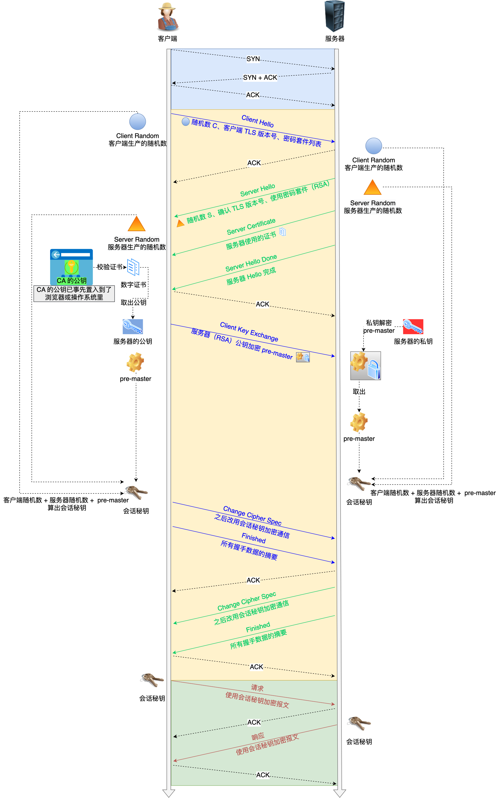

# RSA算法的TLS四次握手

检测对方的数字签名， 验证对方是否有数字签名对应的私钥，并安全地告知对称加密密钥。

1. **TLS 第一次握手**：

   客户端首先会发一个「**Client Hello**」消息，字面意思我们也能理解到，这是跟服务器「打招呼」。

   消息里面有客户端使用的 TLS 版本号、支持的密码套件列表，以及生成的**随机数（*Client Random*）**，这个随机数会被服务端保留，它是生成对称加密密钥的材料之一。

2. **TLS 第二次握手**

   当服务端收到客户端的「Client Hello」消息后，会确认 TLS 版本号是否支持，和从密码套件列表中选择一个密码套件，以及生成**随机数（*Server Random*）**。

3. **TLS 第三次握手**

   客户端验证完证书后，认为可信则继续往下走。接着，客户端就会生成一个新的**随机数 (\*pre-master\*)**，用服务器的 RSA 公钥加密该随机数，通过「**Change Cipher Key Exchange**」消息传给服务端。

4. **TLS 第四次握手**

   服务器也是同样的操作，发「**Change Cipher Spec**」和「**Encrypted Handshake Message**」消息，如果双方都验证加密和解密没问题，那么握手正式完成。

## RSA 算法的缺陷

**使用 RSA 密钥协商算法的最大问题是不支持前向保密**。

因为客户端传递随机数（用于生成对称加密密钥的条件之一）给服务端时使用的是公钥加密的，服务端收到到后，会用私钥解密得到随机数。所以一旦服务端的私钥泄漏了，过去被第三方截获的所有 TLS 通讯密文都会被破解。

为了解决这个问题，后面就出现了 ECDHE 密钥协商算法，我们现在大多数网站使用的正是 ECDHE 密钥协商算法。

# HTTPS ECDHE 握手解析

HTTPS 常用的密钥交换算法有两种，分别是 RSA 和 ECDHE 算法。

## 离散对数

上图的，底数 a 和模数 p 是离散对数的公共参数，也就说是公开的，b 是真数，i 是对数。知道了对数，就可以用上面的公式计算出真数。但反过来，知道真数却很难推算出对数。

**特别是当模数 p 是一个很大的质数，即使知道底数 a 和真数 b ，在现有的计算机的计算水平是几乎无法算出离散对数的，这就是 DH 算法的数学基础。**

根据私钥生成的方式，DH 算法分为两种实现：

- static DH 算法，这个是已经被废弃了；
- DHE 算法，现在常用的；

static DH 算法里有一方的私钥是静态的，也就说每次密钥协商的时候有一方的私钥都是一样的，一般是服务器方固定，即 a 不变，客户端的私钥则是随机生成的。

于是，DH 交换密钥时就只有客户端的公钥是变化，而服务端公钥是不变的，那么随着时间延长，黑客就会截获海量的密钥协商过程的数据，因为密钥协商的过程有些数据是公开的，黑客就可以依据这些数据暴力破解出服务器的私钥，然后就可以计算出会话密钥了，于是之前截获的加密数据会被破解，所以 **static DH 算法不具备前向安全性**。

## DHE算法

既然固定一方的私钥有被破解的风险，那么干脆就让双方的私钥在每次密钥交换通信时，都是随机生成的、临时的，这个方式也就是 DHE 算法，E 全称是 ephemeral（临时性的）。

所以，即使有个牛逼的黑客破解了某一次通信过程的私钥，其他通信过程的私钥仍然是安全的，因为**每个通信过程的私钥都是没有任何关系的，都是独立的，这样就保证了「前向安全」**。

但是，由于DHE 算法计算性能不佳，因为需要做大量的乘法，为了提升 DHE 算法的性能，所以就出现了现在广泛用于密钥交换算法 —— **ECDHE 算法**。

## ECDHE 算法

ECDHE 算法是在 DHE 算法的基础上利用了 ECC 椭圆曲线特性，可以用更少的计算量计算出公钥，以及最终的会话密钥。

小红和小明使用 ECDHE 密钥交换算法的过程：

- 双方事先确定好使用哪种椭圆曲线，和曲线上的基点 G，这两个参数都是公开的；
- 双方各自随机生成一个随机数作为**私钥d**，并与基点 G相乘得到**公钥Q**（Q = dG），此时小红的公私钥为 Q1 和 d1，小明的公私钥为 Q2 和 d2；
- 双方交换各自的公钥，最后小红计算点（x1，y1） = d1Q2，小明计算点（x2，y2） = d2Q1，由于椭圆曲线上是可以满足乘法交换和结合律，所以 d1Q2 = d1d2G = d2d1G = d2Q1 ，因此**双方的 x 坐标是一样的，所以它是共享密钥，也就是会话密钥**。

这个过程中，双方的私钥都是随机、临时生成的，都是不公开的，即使根据公开的信息（椭圆曲线、公钥、基点 G）也是很难计算出椭圆曲线上的离散对数（私钥）。

## 握手过程

[3.4 HTTPS ECDHE 握手解析 | 小林coding (xiaolincoding.com)](https://xiaolincoding.com/network/2_http/https_ecdhe.html#ecdhe-握手过程)