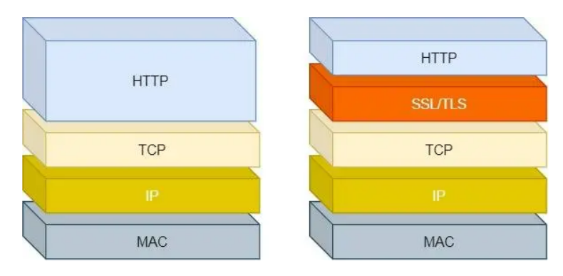

# 加密算法

由于HTTP是明文传输，存在安全问题。

- **窃听风险**，比如通信链路上可以获取通信内容，用户号容易没。

- **篡改风险**，比如强制植入垃圾广告，视觉污染，用户眼容易瞎。

- **冒充风险**，比如冒充淘宝网站，用户钱容易没。

  

HTTP**S** 在 HTTP 与 TCP 层之间加入了 `SSL/TLS` 协议，可以很好的解决了上述的风险：

- **信息加密**：交互信息无法被窃取。
- **校验机制**：无法篡改通信内容，篡改了就不能正常显示。
- **身份证书**：证明淘宝是真的淘宝网。

HTTPS 采用的是**对称加密**和**非对称加密**结合的「混合加密」方式。

**1. 混合加密**

通过**混合加密**的方式可以保证信息的**机密性**，解决了窃听的风险。

## 如何保证安全呢？

1. 内容有可能会被窃取呀。如何保证内容不被窃取呢？

   那使用加密算法嘛。

2. **内容有可能被修改呀。如何保证内容不被修改呢？**

   使用摘要算法（哈希函数），算出来一个哈希值，传输时将哈希值也传输过去，接收方使用同样的哈希函数算出值来比对。

   但是，通过哈希算法可以确保内容不会被篡改，**但是并不能保证「内容 + 哈希值」不会被中间人替换，因为这里缺少对客户端收到的消息是否来源于服务端的证明**。

3. 如何保证这个信息是真的发送方而不是伪造的呢？

   用数字签名嘛，有了签名就可用证明身份了。

   但是，数字签名也是可伪造的呀？

**于是，就有了混合加密**。

- 在通信建立前采用**非对称加密**的方式交换「会话秘钥」，后续就不再使用非对称加密。
- 在通信过程中全部使用**对称加密**的「会话秘钥」的方式加密明文数据。

**采用「混合加密」的方式的原因**：

- **对称加密**只使用一个密钥，运算速度快，密钥必须保密，无法做到安全的密钥交换。
- **非对称加密**使用两个密钥：公钥和私钥，公钥可以任意分发而私钥保密，解决了密钥交换问题但速度慢。

这两个密钥可以**双向加解密**的，比如可以用公钥加密内容，然后用私钥解密，也可以用私钥加密内容，公钥解密内容。

公钥通过网络加密传输，私钥自己保存。

- **公钥加密，私钥解密**。这个目的是为了**保证内容传输的安全**，因为被公钥加密的内容，其他人是无法解密的，只有持有私钥的人，才能解密出实际的内容；
- **私钥加密，公钥解密**。这个目的是为了**保证消息不会被冒充**，因为私钥是不可泄露的，如果公钥能正常解密出私钥加密的内容，就能证明这个消息是来源于持有私钥身份的人发送的。

因此，现在只要保证数字签名没问题，我发给你的公钥不被窃取或者修改，就可以保证安全。那要怎么保证你安全地得到我的公钥和数字签名呢？

**权威机构CA登场，全靠信誉吃饭。**

* 服务器把自己的公钥注册到CA。
* CA用自己的私钥给服务器的数字签名和公钥加密成「数字证书」
* 将CA的公钥安全地写入操作系统或者浏览器。

这个过程主要保证数字签名和公钥绑定, 无法被篡改。

## 经典算法

经典非对称加密算法

* RSA
* DSA
* DH
* ECDHE

经典对称加密算法

* DES

* AES

  

## 相关问题

**为什么需要CA呢？直接发送公钥，保留私钥不就好了吗？**

这种情况数字签名可能被伪造， 即冒充某个服务器。

**我收集到了服务的数字证书，现在想冒充它，给客户端捏造内容，附上真的数字证书，可以可得逞吗？**

验证的环节是没问题的，客户端可以得到真正的数字签名和公钥，但是冒充的服务器没有真正的私钥，在第四次握手验证时会出现问题。

