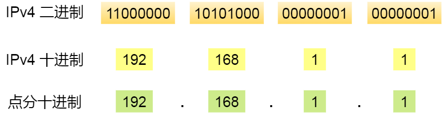
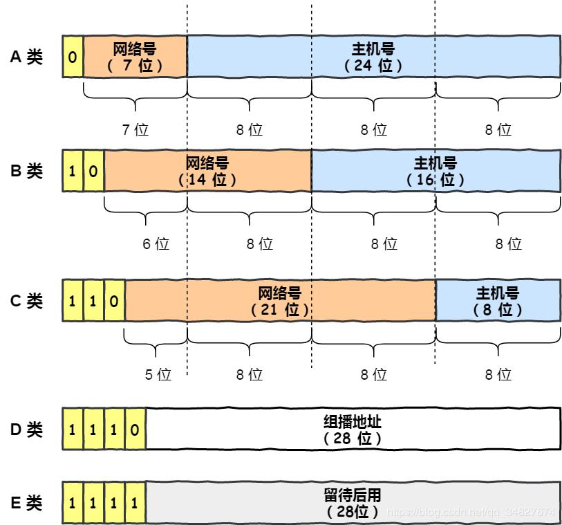
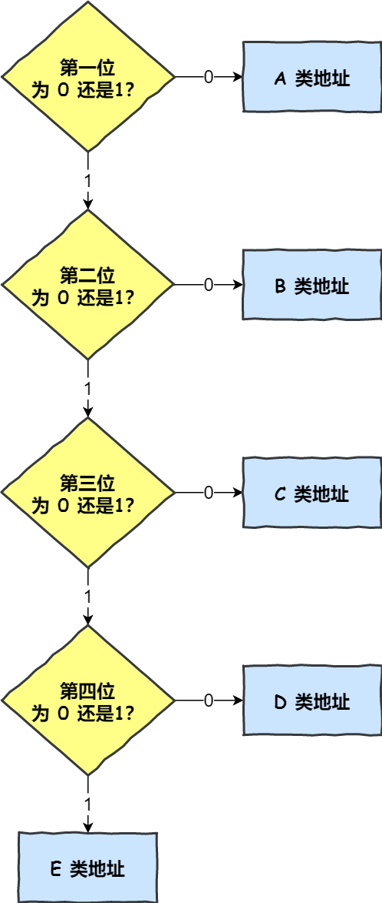
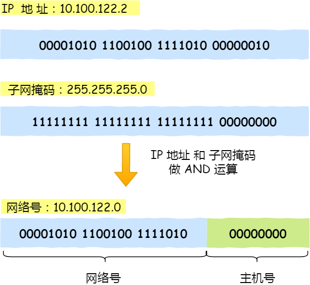
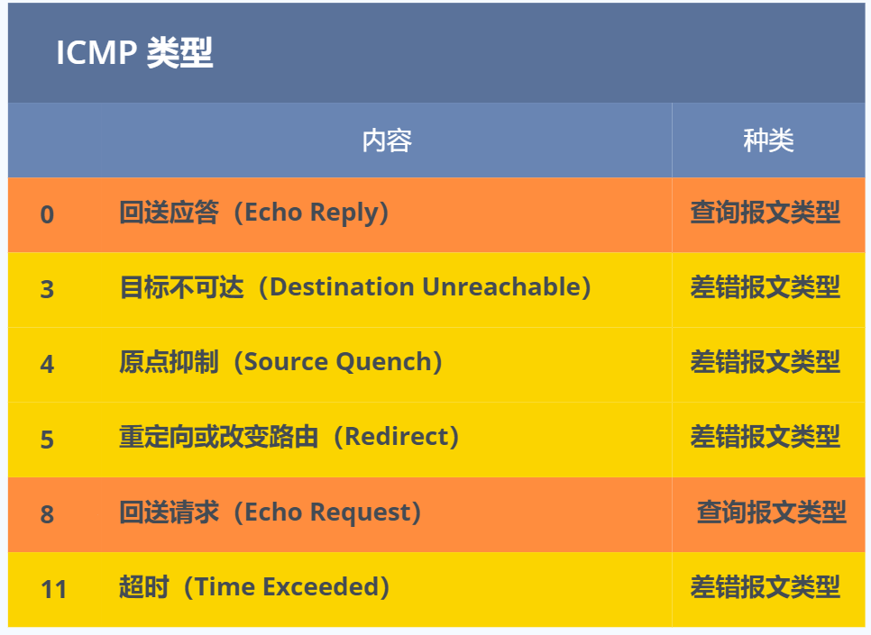

# IP地址

IP地址演变过程, 首先是IPv4.

IPv4共32位bit, 以每 8 位为组，共分为 `4` 组，每组以「`.`」隔开，再将每组转换成十进制。

由于只有32位, 故最大值为

也就说，最大允许 43 亿台计算机连接到网络。

实际上，IP 地址并不是根据主机台数来配置的，而是以网卡。像服务器、路由器等设备都是有 2 个以上的网卡，也就是它们会有 2 个以上的 IP 地址。

因此，让 43 亿台计算机全部连网其实是不可能的，更何况 IP 地址是由「网络标识」和「主机标识」这两个部分组成的，所以实际能够连接到网络的计算机个数更是少了很多。

## IP地址分类

互联网诞生之初，IP 地址显得很充裕，于是计算机科学家们设计了**分类地址**。

IP 地址分类成了 5 种类型，分别是 A 类、B 类、C 类、D 类、E 类。

### ABC类地址

对于复杂场景, 需要一些特殊IP地址有不一样的用途.

- 主机号全为 1 指定某个网络下的所有主机，用于广播
- 主机号全为 0 指定某个网络

广播地址用于在**同一个链路中相互连接的主机之间发送数据包**。

- **在本网络内广播的叫做本地广播**。例如网络地址为 192.168.0.0/24 的情况下，广播地址是 192.168.0.255 。因为这个广播地址的 IP 包会被路由器屏蔽，所以不会到达 192.168.0.0/24 以外的其他链路上。
- **在不同网络之间的广播叫做直接广播**。例如网络地址为 192.168.0.0/24 的主机向 192.168.1.255/24 的目标地址发送 IP 包。收到这个包的路由器，将数据转发给 192.168.1.0/24，从而使得所有 192.168.1.1~192.168.1.254 的主机都能收到这个包（由于直接广播有一定的安全问题，多数情况下会在路由器上设置为不转发)。

### D、E 类地址

而 D 类和 E 类地址是没有主机号的，所以不可用于主机 IP，D 类常被用于**多播**，E 类是预留的分类，暂时未使用。

多播用于**将包发送给特定组内的所有主机。**

还是举班级的栗子，老师说：“最后一排的同学，上来做这道数学题。”，老师指定的是最后一排的同学，也就是多播的含义了。

由于广播无法穿透路由，若想给其他网段发送同样的包，就可以使用可以穿透路由的多播。

### 如何判别是哪类地址?

### IP分类的缺点

**缺点一**: 同一网络下没有地址层次

* 比如一个公司里用了 B 类地址，但是可能需要根据生产环境、测试环境、开发环境来划分地址层次，而这种 IP 分类是没有地址层次划分的功能，所以这就**缺少地址的灵活性**.

**缺点二**: 网络无法自适应主机数, 导致一个网络下的IP地址浪费或者不够用.

* C 类地址能包含的最大主机数量实在太少了，只有 254 个，估计一个网吧都不够用。
* 而 B 类地址能包含的最大主机数量又太多了，6 万多台机器放在一个网络下面，一般的企业基本达不到这个规模，闲着的地址就是浪费。

**因此, 提出了无分类IP方案. 即CIDR**.

## 无分类IP方案

### 子网掩码: Mask

首先是子网掩码, 是一个使用额外的32bit, 来区分网络和主机号的机制.**将子网掩码和 IP 地址按位计算`&`，就可得到网络号。**

由于子网掩码占用了32个bit, 因此在IP地址后使用`/`区分网络号和主机号的机制:CIDR.

### CIDR

>  CIDR的全称是Classless Interdomain Routing, 即无类别域间路由, 是子网掩码的另一种表现形式.

**表示形式为: ** `a.b.c.d/x`，其中 `/x` 表示前 x 位属于**网络号**， x 的范围是 `0 ~ 32`，这就使得 IP 地址更加具有灵活性。

**有了自由分类网络号和主机号的机制, 就可以更灵活的配置网络.**

**但是, 前面我们提到, IP数是由上限的, 不可能把所有设备都接入互联网. 因此, 对于IP地址不够用的情况, 就衍生出公有 IP 地址与私有 IP 地址.**

## 公有 IP 地址与私有 IP 地址

>  公有 IP 地址是有个组织统一分配的, 由`ICANN` 组织管理，中文叫「互联网名称与数字地址分配机构」。

**公有IP:**假设你要开一个博客网站，那么你就需要去申请购买一个公有 IP，这样全世界的人才能访问。并且公有 IP 地址基本上要在整个互联网范围内保持唯一。

**私有IP**:平时我们办公室、家里、学校用的 IP 地址，一般都是私有 IP 地址。因为这些地址允许组织内部的 IT 人员自己管理、自己分配，而且可以重复。因此，你学校的某个私有 IP 地址和我学校的可以是一样的。

**那么问题来了, 私有IP如何接入互联网呢? NAT应运而生**

##  NAT/NAPT

> 简单的来说 NAT 就是同个公司、家庭、教室内的主机对外部通信时，把私有 IP 地址转换成公有 IP 地址。

**那不是 N 个私有 IP 地址，你就要 N 个公有 IP 地址？这怎么就缓解了 IPv4 地址耗尽的问题？这不瞎扯吗？**

确实是，普通的 NAT 转换没什么意义。

由于绝大多数的网络应用都是使用传输层协议 TCP 或 UDP 来传输数据的。

因此，可以把 **IP 地址 + 端口号一起进行转换**。

这样，就用一个全球 IP 地址就可以了，这种转换技术就叫**网络地址与端口转换 NAPT。**

### 转换过程

生成一个 NAPT 路由器的转换表，就可以正确地转换地址跟端口的组合，令客户端 A、B 能同时与服务器之间进行通信。

这种转换表在 NAT 路由器上自动生成。例如，在 TCP 的情况下，建立 TCP 连接首次握手时的 SYN 包一经发出，就会生成这个表。而后又随着收到关闭连接时发出 FIN 包的确认应答从表中被删除。

**NAPT 那么牛逼，难道就没缺点了吗？**

### 缺点

由于 NAT/NAPT 都依赖于自己的转换表，因此会有以下的问题：

- 外部无法主动与 NAT 内部服务器建立连接，因为 NAPT 转换表没有转换记录。
- 转换表的生成与转换操作都会产生性能开销。
- 通信过程中，如果 NAT 路由器重启了，所有的 TCP 连接都将被重置。

### 优化方案

**优化方案一**

* **NAT穿透技术**: 客户端主动从 NAT 设备获取公有 IP 地址，然后自己建立端口映射条目，然后用这个条目对外通信，就不需要 NAT 设备来进行转换了。

**优化方案二**:  上IPv6.

## IP协议相关技术

* DNS: 已知域名求IP
* **ARP**: 已知IP求Mac地址.**RARP**: 已知Mac求IP地址. 常用于打印机等小型嵌入式设备.
* DHCP: 动态获取IP地址.
* NAT/NAPT: 私有IP转换成公有IP接入互联网.
* **ICMP**: 互联网控制报文协议, 指令`PING`用到该技术 .[5.2 ping 的工作原理)](https://xiaolincoding.com/network/4_ip/ping.html#ping-查询报文类型的使用)
* IGMP: 

### DHCP

> DHCP 在生活中我们是很常见的了，我们的电脑通常都是通过 DHCP 动态获取 IP 地址，大大省去了配 IP 信息繁琐的过程。

先说明一点，DHCP 客户端进程监听的是 68 端口号，DHCP 服务端进程监听的是 67 端口号。

**请求过程**

1. 客户端使用`UDP`广播,查询`DHCP`服务器地址. 使用的是`255.255.255.255（端口 67）`并且使用 `0.0.0.0（端口 68）` 作为源 IP 地址.
2. DHCP 服务器收到 DHCP 发现报文时，用 **DHCP 提供报文（DHCP OFFER）** 向客户端做出响应。该报文仍然使用 IP 广播地址 255.255.255.255，该报文信息携带服务器提供可租约的 IP 地址、子网掩码、默认网关、DNS 服务器以及 **IP 地址租用期**。
3. 客户端收到一个或多个服务器的 DHCP 提供报文后，从中选择一个服务器，并向选中的服务器发送 **DHCP 请求报文（DHCP REQUEST**)进行响应，回显配置的参数。
4. 最后，服务端用 **DHCP ACK 报文**对 DHCP 请求报文进行响应，应答所要求的参数。

如果租约的 DHCP IP 地址快期后，客户端会向服务器发送 DHCP 请求报文：

- 服务器如果同意继续租用，则用 DHCP ACK 报文进行应答，客户端就会延长租期。
- 服务器如果不同意继续租用，则用 DHCP NACK 报文，客户端就要停止使用租约的 IP 地址。

可以发现，DHCP 交互中，**全程都是使用 UDP 广播通信**。

**咦，用的是广播，那如果 DHCP 服务器和客户端不是在同一个局域网内，路由器又不会转发广播包，那不是每个网络都要配一个 DHCP 服务器？**

所以，为了解决这一问题，就出现了 **DHCP 中继代理**。有了 DHCP 中继代理以后，**对不同网段的 IP 地址分配也可以由一个 DHCP 服务器统一进行管理。**

- DHCP 客户端会向 DHCP 中继代理发送 DHCP 请求包，而 DHCP 中继代理在收到这个广播包以后，再以**单播**的形式发给 DHCP 服务器。
- 服务器端收到该包以后再向 DHCP 中继代理返回应答，并由 DHCP 中继代理将此包广播给 DHCP 客户端 。

因此，DHCP 服务器即使不在同一个链路上也可以实现统一分配和管理IP地址。

### ICMP

> ICMP 全称是 **Internet Control Message Protocol**，也就是**互联网控制报文协议**。

`ICMP` 主要的功能包括：**确认 IP 包是否成功送达目标地址、报告发送过程中 IP 包被废弃的原因和改善网络设置等。**

在 `IP` 通信中如果某个 `IP` 包因为某种原因未能达到目标地址，那么这个具体的原因将**由 ICMP 负责通知**。

ICMP 大致可以分为两大类：

- 一类是用于诊断的查询消息，也就是「**查询报文类型**」
- 另一类是通知出错原因的错误消息，也就是「**差错报文类型**」

### IGMP

> 在前面我们知道了组播地址，也就是 D 类地址，既然是组播，那就说明是只有一组的主机能收到数据包，不在一组的主机不能收到数组包，怎么管理是否是在一组呢？那么，就需要 `IGMP` 协议了。

[5.1 IP 基础知识全家桶 | 小林coding (xiaolincoding.com)](https://xiaolincoding.com/network/4_ip/ip_base.html#igmp)

