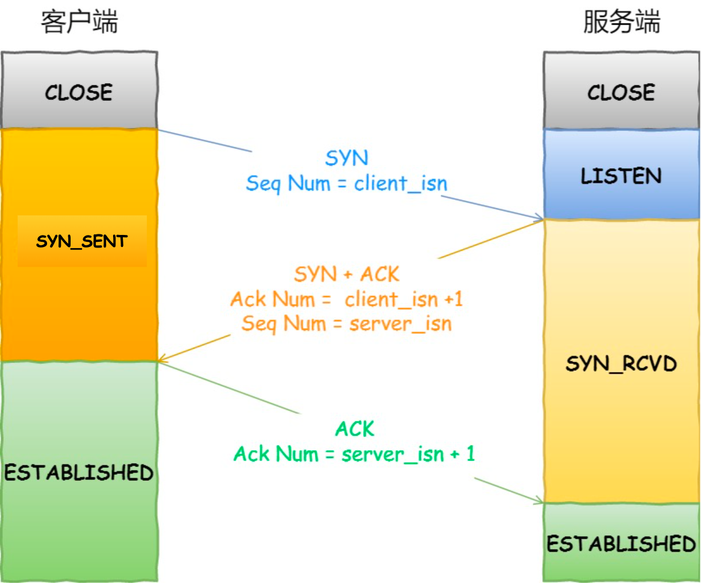
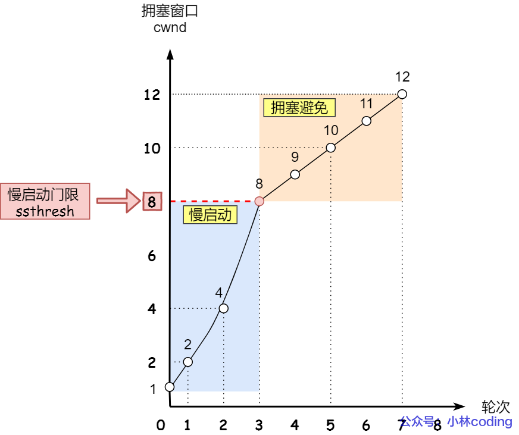
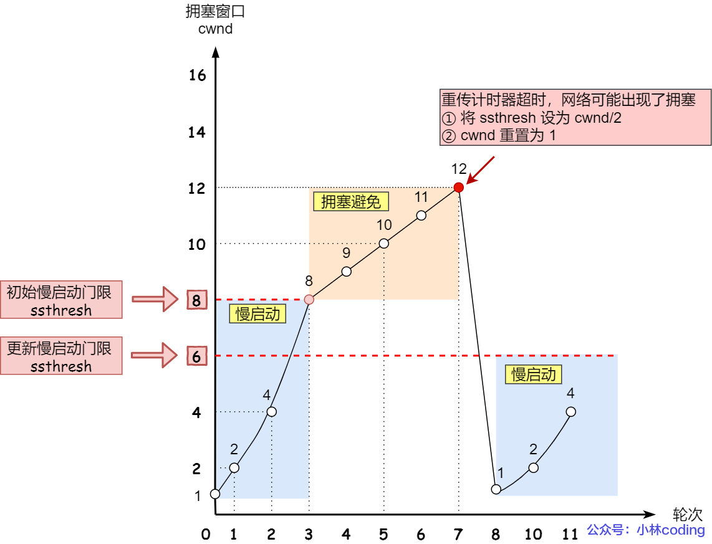
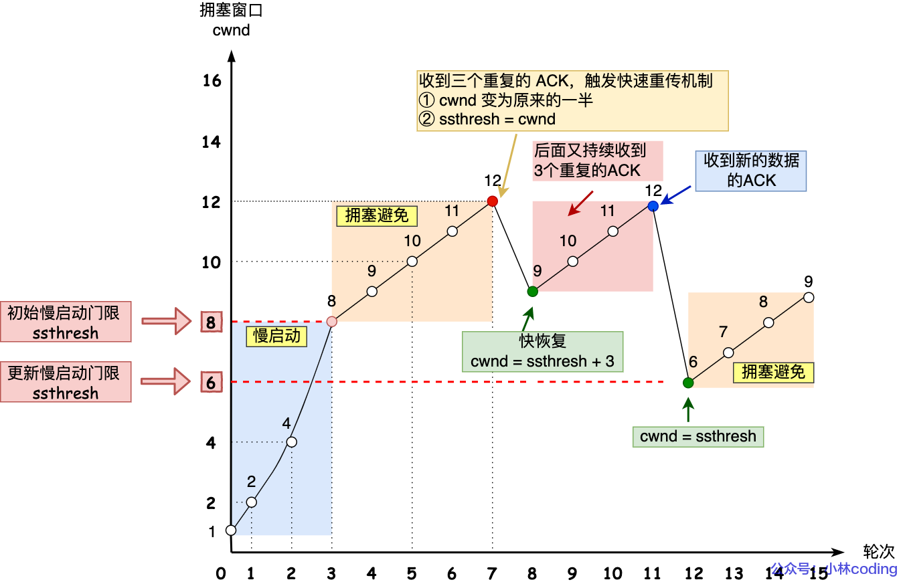
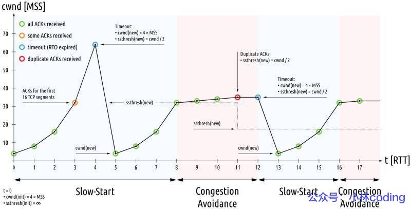

# TCP

TCP 是**面向连接的、可靠的、基于字节流**的传输层通信协议。

- **面向连接**：一定是「一对一」才能连接，不能像 UDP 协议可以一个主机同时向多个主机发送消息，也就是一对多是无法做到的；
- **可靠的**：无论的网络链路中出现了怎样的链路变化，TCP 都可以保证一个报文一定能够到达接收端；
- **字节流**：用户消息通过 TCP 协议传输时，消息可能会被操作系统「分组」成多个的 TCP 报文，如果接收方的程序如果不知道「消息的边界」，是无法读出一个有效的用户消息的。并且 TCP 报文是「有序的」，当「前一个」TCP 报文没有收到的时候，即使它先收到了后面的 TCP 报文，那么也不能扔给应用层去处理，同时对「重复」的 TCP 报文会自动丢弃。

**什么是 TCP 连接？**

我们来看看 RFC 793 是如何定义「连接」的：

*Connections: The reliability and flow control mechanisms described above require that TCPs initialize and maintain certain status information for each data stream. The combination of this information, including sockets, sequence numbers, and window sizes, is called a connection.*

简单来说就是，**用于保证可靠性和流量控制维护的某些状态信息，这些信息的组合，包括Socket、序列号和窗口大小称为连接。**

- **Socket**：由 IP 地址和端口号组成
- **序列号**：用来解决乱序问题等
- **窗口大小**：用来做流量控制

**有了IP, 为什么还需要TCP?**

`IP` 层是「不可靠」的，因为:

* 网络包是否交付
* 不保证网络包的按序交付
* 也不保证网络包中的数据的完整性

**因此,  就需要更高一层的TCP来保证.**

## **TCP 和 UDP 区别：**

*1. 连接*

- TCP 是面向连接的传输层协议，传输数据前先要建立连接。
- UDP 是不需要连接，即刻传输数据。

*2. 服务对象*

- TCP 是一对一的两点服务，即一条连接只有两个端点。
- UDP 支持一对一、一对多、多对多的交互通信

*3. 可靠性*

- TCP 是可靠交付数据的，数据可以无差错、不丢失、不重复、按需到达。
- UDP 是尽最大努力交付，不保证可靠交付数据。

*4. 拥塞控制、流量控制*

- TCP 有拥塞控制和流量控制机制，保证数据传输的安全性。
- UDP 则没有，即使网络非常拥堵了，也不会影响 UDP 的发送速率。

*5. 首部开销*

- TCP 首部长度较长，会有一定的开销，首部在没有使用「选项」字段时是 `20` 个字节，如果使用了「选项」字段则会变长的。
- UDP 首部只有 8 个字节，并且是固定不变的，开销较小。

*6. 传输方式*

- TCP 是流式传输，没有边界，但保证顺序和可靠。
- UDP 是一个包一个包的发送，是有边界的，但可能会丢包和乱序。

*7. 分片不同*

- TCP 的数据大小如果大于 MSS 大小，则会在传输层进行分片，目标主机收到后，也同样在传输层组装 TCP 数据包，如果中途丢失了一个分片，只需要传输丢失的这个分片。
- UDP 的数据大小如果大于 MTU 大小，则会在 IP 层进行分片，目标主机收到后，在 IP 层组装完数据，接着再传给传输层。

## **TCP 和 UDP 应用场景**

由于 TCP 是面向连接，能保证数据的可靠性交付，因此经常用于：

- `FTP` 文件传输；
- HTTP / HTTPS；

由于 UDP 面向无连接，它可以随时发送数据，再加上UDP本身的处理既简单又高效，因此经常用于：

- 包总量较少的通信，如 `DNS` 、`SNMP` 等；
- 视频、音频等多媒体通信；
- 广播通信；

## TCP连接建立: 三次握手

**过程图解如下**(注意`Client `和`Server`的状态变化):

* 第一次握手(`SYN`): 客户端发送`SYN`请求报文, 告知`Seq Num = client_isn`
* 第二次握手(`ACK + SYN`): 服务端用`ACK`表示确认收到, `SYN`告知`Seq Num = server_isn`
* 第三次握手(`ACK`): 客户端`ACK`表示收到了`Seq Num`

**可以看到, 请求连接过程实际上发送接受了四个报文, 只不过第二次两个报文可以同时发送**.

## TCP断开连接: 四次挥手

**过程图解如下**:(同样注意双方状态变化)

* 第一次握手(`FIN`): 客户端要关闭连接, 发送`FIN`告诉服务端.
* 第二次握手(`ACK`): 服务端表示收到了客户端的`FIN`, 发送`ACK`表示收到.但是, 还有些数据没发送完, 稍等一会我这边再断开.
* 第三次握手(`FIN`): 服务端处理完了, 发送`FIN`告诉客户端.
* 第四次握手(`ACK`): 客户端发送`ACK`, 说"知道啦, 咱断开吧''.

## 重传机制

### 超时重传

当发送端发送数据后， 定时器开始计时，没有接到`ACK`报文， 超过限定时间后，重新传输。这就是**超时重传**。

**触发情况**

* 数据包丢失。
* 接收方接收到了， 但是`ACK`报文在网络中丢失或者失效。

**怎么确定多久就判定超时呢？**

**RTT和RTO**

> RTT: round trip time
>
> RT0: retransmission timeout

不难得知， **超时重传时间 RTO 的值应该略大于报文往返 RTT 的值**。

实际上「报文往返 RTT 的值」是经常变化的，因为我们的网络也是时常变化的。也就因为「报文往返 RTT 的值」 是经常波动变化的，所以「超时重传时间 RTO 的值」应该是一个**动态变化的值**。

如果超时重发的数据，再次超时的时候，又需要重传的时候，TCP 的策略是**超时间隔加倍。**

也就是**每当遇到一次超时重传的时候，都会将下一次超时时间间隔设为先前值的两倍。两次超时，就说明网络环境差，不宜频繁反复发送。**

### 快速重传

**触发情况**

* 当发送方接收到三个`ACK`报文都表示同一个数据块时， 会触发**快速重传**。

### SACK重传

> SACK： 即Selective Acknowledgement。

接收方在`ACK`报文头部中， 添加当前接收数据包的图表，表示当前数据包的接收情况。

发送方接收到`ACK`报文即可确定是否需要重发。

#### D-SACK

> Duplicate Selective Acknowledgement.

`SACK`说明该部分重复接收了。

D-SACK不是一种新的机制， 而是当发送方收到`ACK(SACK)`报文后, 比对当前的`SACK`和`ACK`,以及是否有重传现象来说明一些重传问题。情况如下：

* 如果`SACK`小于`ACK`且无重传，则`SACK`对应数据包收到了， 但其`ACK`丢了。
* 如果`SACK`小于`ACK`且有重传， 说明数据包延时到达了。
* 如果`SACK`小于`ACK`且无重传且`SACK`对应的`ACK`包被接收， 说明「发送方」的数据包被复制了;

## 滑动窗口

由于每发送一次就等待一次`ACK`, 太久了。 就衍生出了**滑动窗口**的概念， 发送一次后，无需等待`ACK`，可以再次发送，由序列号来确认数据包拼接顺序。

### 具体实现

**发送方**

* 发送方维护三个指针变量（最小发送序号， 下一个数据包发送序号， 滑动窗口最大值）实现。
* 接收到的`ACK`指示， 小于该值的数据包都已经接收。可以移动窗口，发送新数据了。

**接收方**

* 接收方维护两个指针变量控制窗口(仅接收窗口之内的数据包)
* 窗口左侧的数据包到达后， 窗口左侧移动到下一个未到达的窗口。
* 回复的`ACK`中会通过`TCP字段: window`来指示接收窗口的大小，动态调整发送速度。

窗口大小，一般由接收方控制， 发送方和接收方的窗口大小大致相等（**受操作系统和接收方数据处理速度影响**）。

## 流量控制

考虑到接收方处理能力和窗口大小， 需要对发送流量进行控制。

考虑以下情况

* 接收方的操作系统缓存区不够用了， 缩小了其TCP传输的滑动窗口。
* 接收方的滑动窗口里的数据处不过来，无法移动。

 在以上情况发生时，窗口可用大小可能为0（即窗口关闭），或者太小。

### 窗口关闭

窗口为0时，即窗口关闭， 

* **发送方会等待接收方发送新的`ACK`告知非0窗口信号**

* **但若这个`ACK`报文丢失了，发送方迟迟等不到， 就会造成死锁**。

因此，发送方收到窗口关闭`ACK`时， 启动计时， 超时则发送窗口探测*window Probe*报文, 请求重发. 

若探测三次仍是窗口关闭，有些TCP就会选择`RST`来中断连接。

### 糊涂窗口综合征

> 即接收方告知自己窗口很小， 耿直的发送方就发送这么小的数据。

用TCP40个字节的报文去发送几个字节的数据是不值得的。

因此， 可以从两边考虑解决这个问题。如

* 发送方窗口很小时，如小于1`MSS`， 或者缓存空间少于一半，直接告知窗口关闭。
* 采用`Nagle`算法，避免接收方发送小数据。

#### Nagle算法

它满足以下两个条件中的一条才可以发送数据：

- 要等到窗口大小 >= `MSS` 或是 数据大小 >= `MSS`
- 收到之前发送数据的 `ack` 回包

**但是对于一些需要小数据包交互的场景的程序，比如，telnet 或 ssh 这样的交互性比较强的程序，则需要关闭 Nagle 算法**。

## 拥塞控制

拥塞控制是为了防止互联网拥塞的， 当网络拥塞时，会降低发送频率。

因此， 拥塞控制主要针对发送方。为了调节发送量，类似滑动窗口， 引出了**拥塞窗口**的概念。**发送窗口取的是接收窗口和拥塞窗口的最小值。**

### 拥塞窗口

> Congestion Window

拥塞窗口 `cwnd` 变化的规则：

- 只要网络中没有出现拥塞，`cwnd` 就会增大；
- 但网络中出现了拥塞，`cwnd` 就减少；

拥塞控制主要是四个算法：

- 慢启动
- 拥塞避免
- 拥塞发生
- 快速恢复

### 慢启动

**当发送方每收到一个 ACK，拥塞窗口 cwnd 的大小就会加 1**

* 建立连接后，初始化`cwnd = 1`，发送一个数据包。
* 接收到`ACK`,`cwnd += 1`,发送2个数据包。
* 接收到2个`ACK`，`cwnd += 2`,发送4个数据包。
* ...

可以看出慢启动算法，发包的个数是**指数性的增长** 

**那慢启动涨到什么时候是个头呢？** 

有一个叫慢启动门限 `ssthresh` （*slow start threshold*）状态变量。

- 当 `cwnd` < `ssthresh` 时，使用慢启动算法。
- 当 `cwnd` >= `ssthresh` 时，就会使用「拥塞避免算法」。

### 拥塞避免

当 `cwnd` >= `ssthresh` 时，就会使用「拥塞避免算法」。

一般来说 `ssthresh` 的大小是 `65535` 字节。

进入拥塞避免算法后，它的规则是：**每当收到一个 ACK 时，cwnd 增加 1/cwnd。**

**但是这还是会一直增长呀，会造成网络拥堵的。当网络拥堵时，在TCP连接中就体现为数据包重传**。

### 拥塞发生

我们知道有两种重传机制

* 超时重传
* 快速重传

#### 超时重传时

说明数据包已经很难到达了， 因此需要大幅减小发送窗口。此时，将

* `ssthresh` 设为 `cwnd/2`，
* `cwnd` 重置为 `1`

**一夜回到解放前**，请看图解

一下子降低到谷底， 很容易就发生卡顿。因此，这肯定不适用于所有网络情况，需要辅以更平缓的算法。

#### 快速重传时

当发生快速重传时，说明还能收到3个`ACK`包， 也就没有那么拥塞。

- `cwnd = cwnd/2` ，也就是设置为原来的一半;
- `ssthresh = cwnd`;

注意，此时除了将`cwnd = cwnd/2`与超时重传不同外，**还会进入快速恢复算法**

##### 快速恢复算法

* 拥塞窗口 `cwnd = ssthresh + 3` （ 3 的意思是确认有 3 个数据包被收到了）；
* 重传丢失的数据包；
* 如果再收到重复的 ACK，那么 cwnd 增加 1；
* 如果收到新数据的 ACK 后，把 `cwnd` 设置为第一步中的 `ssthresh` 的值，原因是该 ACK 确认了新的数据，说明从 duplicated ACK 时的数据都已收到，该恢复过程已经结束，可以回到恢复之前的状态了，也即再次进入拥塞避免状态；

#### 拥塞发生整体示意图

## 相关问题

> 解答见：[4.1 TCP 三次握手与四次挥手面试题 | 小林coding (xiaolincoding.com)](https://xiaolincoding.com/network/3_tcp/tcp_interview.html#tcp-连接建立)

1. 为什么是三次握手？不是两次、四次？
2. 为什么每次建立 TCP 连接时，初始化的序列号都要求不一样呢？
3. 初始序列号 ISN 是如何随机产生的？
4. 既然 IP 层会分片，为什么 TCP 层还需要 MSS 呢？
5. 第一次握手丢失了，会发生什么？
6. 第二次握手丢失了，会发生什么？
7. 第三次握手丢失了，会发生什么？
8. 什么是 SYN 攻击？如何避免 SYN 攻击？
9. 为什么挥手需要四次？
10. 第一次挥手丢失了，会发生什么？
11. 第二次挥手丢失了，会发生什么？
12. 第三次挥手丢失了，会发生什么？
13. 第四次挥手丢失了，会发生什么？
14. 为什么 TIME_WAIT 等待的时间是 2MSL？
15. 为什么需要 TIME_WAIT 状态？
16. TIME_WAIT 过多有什么危害？
17. 如何优化 TIME_WAIT？
18. 如果已经建立了连接，但是客户端突然出现故障了怎么办？
19. 如果已经建立了连接，但是服务端的进程崩溃会发生什么？
20. Socket 编程...

**其他方面**

1. 已经建立TCP连接时， 拔掉网线， 断电，宕机，进程奔溃后，TCP状态是怎么样的？
2. HTTPS中的TLS和TCP能同时握手吗？
3. TCP Keepalive 和 HTTP Keep-Alive 是一个东西吗?
4. `tcp_tw_reuse` 为什么默认是关闭的？

