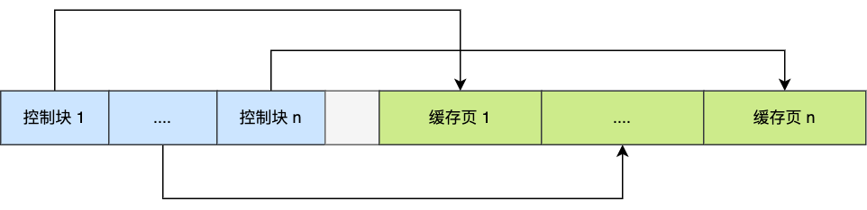
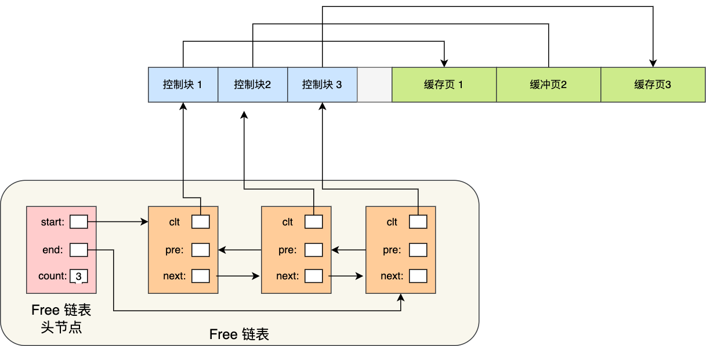
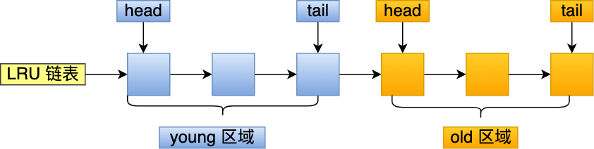

# Buffer Pool

由于MySQL的数据存储在磁盘, 每次都从磁盘读取, 性能不高. 因此有了`Buffer Pool　`的概念

有了缓冲池后：

- 当读取数据时，如果数据存在于 Buffer Pool 中，客户端就会直接读取 Buffer Pool 中的数据，否则再去磁盘中读取。
- 当修改数据时，首先是修改 Buffer Pool 中数据所在的页，然后将其页设置为脏页，最后由后台线程将脏页写入到磁盘。

### Buffer Pool 有多大？

Buffer Pool 是在 MySQL 启动的时候，向操作系统申请的一片连续的内存空间，默认配置下 Buffer Pool 只有 `128MB` 。

可以通过调整 `innodb_buffer_pool_size` 参数来设置 Buffer Pool 的大小，一般建议设置成可用物理内存的 60%~80%。

### Buffer Pool 缓存什么？

InnoDB存储数据的单位是页, 默认16KB, 因此Buffer Pool也按页来划分.

在 MySQL 启动的时候，**InnoDB 会为 Buffer Pool 申请一片连续的内存空间，然后按照默认的`16KB`的大小划分出一个个的页， Buffer Pool 中的页就叫做缓存页**。此时这些缓存页都是空闲的，之后随着程序的运行，才会有磁盘上的页被缓存到 Buffer Pool 中。

所以，MySQL 刚启动的时候，你会观察到使用的虚拟内存空间很大，而使用到的物理内存空间却很小，这是因为只有这些虚拟内存被访问后，操作系统才会触发缺页中断，接着将虚拟地址和物理地址建立映射关系。

Buffer Pool 除了缓存「索引页」和「数据页」，还包括了 undo 页，插入缓存、自适应哈希索引、锁信息等等。

为了更好的管理这些在 Buffer Pool 中的缓存页，InnoDB 为每一个缓存页都创建了一个**控制块**，控制块信息包括「缓存页的表空间、页号、缓存页地址、链表节点」等等。

控制块也是占有内存空间的，它是放在 Buffer Pool 的最前面，接着才是缓存页，如下图：

上图中控制块和缓存页之间灰色部分称为碎片空间。

**为什么会有碎片空间呢？**

你想想啊，每一个控制块都对应一个缓存页，那在分配足够多的控制块和缓存页后，可能剩余的那点儿空间不够一对控制块和缓存页的大小，自然就用不到喽，这个用不到的那点儿内存空间就被称为碎片了。

当然，如果你把 Buffer Pool 的大小设置的刚刚好的话，也可能不会产生碎片。

**查询一条记录，就只需要缓冲一条记录吗？**

不是的。

当我们查询一条记录时，InnoDB 是会把整个页的数据加载到 Buffer Pool 中，因为，通过索引只能定位到磁盘中的页，而不能定位到页中的一条记录。将页加载到 Buffer Pool 后，再通过页里的页目录去定位到某条具体的记录。

关于页结构长什么样和索引怎么查询数据的问题可以在这篇找到答案：[换一个角度看 B+ 树](https://mp.weixin.qq.com/s/A5gNVXMNE-iIlY3oofXtLw)

## 如何管理 Buffer Pool？

### 如何管理空闲页？

Buffer Pool 是一片连续的内存空间，当 MySQL 运行一段时间后，这片连续的内存空间中的缓存页既有空闲的，也有被使用的。

那当我们从磁盘读取数据的时候，总不能通过遍历这一片连续的内存空间来找到空闲的缓存页吧，这样效率太低了。

所以，为了能够快速找到空闲的缓存页，可以使用链表结构，将空闲缓存页的「控制块」作为链表的节点，这个链表称为 **Free 链表**（空闲链表）。

Free 链表上除了有控制块，还有一个头节点，该头节点包含链表的头节点地址，尾节点地址，以及当前链表中节点的数量等信息。

Free 链表节点是一个一个的控制块，而每个控制块包含着对应缓存页的地址，所以相当于 Free 链表节点都对应一个空闲的缓存页。

有了 Free 链表后，每当需要从磁盘中加载一个页到 Buffer Pool 中时，就从 Free链表中取一个空闲的缓存页，并且把该缓存页对应的控制块的信息填上，然后把该缓存页对应的控制块从 Free 链表中移除。

### 如何管理脏页？

设计 Buffer Pool 除了能提高读性能，还能提高写性能，也就是更新数据的时候，不需要每次都要写入磁盘，而是将 Buffer Pool 对应的缓存页标记为**脏页**，然后再由后台线程将脏页写入到磁盘。

那为了能快速知道哪些缓存页是脏的，于是就设计出 **Flush 链表**，它跟 Free 链表类似的，链表的节点也是控制块，区别在于 Flush 链表的元素都是脏页。

有了 Flush 链表后，后台线程就可以遍历 Flush 链表，将脏页写入到磁盘。

### 如何提高缓冲命中率

最容易想到的是 LRU(*Least recently used*)算法.

但会出现一些问题

* 预读失败
* Buffer Pool污染

**什么是预读失败?**

MySQL在加载数据页的时候, 由于程序的空间局部性的存在, 会将被访问数据的周围数据也加载进来, 以此减少磁盘I/O, 但是**有可能这些数据没有被访问到**, 这就是**预读失败**.

这些数据页加在头部, 可能一次性把末尾的页给淘汰. 由于程序的空间局部性原理仍然成立, 因此需要保留预读机制.

MySQL改进LRU算法, 将LRU划分成两个区域, **old区域和young区域**

young在前, old在后优先被淘汰.

预读页加入到old区域的头部, 不影响young中高频使用的数据页.

访问到了才加到young区域.

**什么是Buffer Pool污染**

短时间内访问了大量数据页, 导致Buffer Pool被这些仅访问一次的数据冲刷.

MySQL是这样处理的, 进入到yound区域的条件增加了一个停留在old区域的时间判断.

具体是这样做的，在对某个处在 old 区域的缓存页进行第一次访问时，就在它对应的控制块中记录下来这个访问时间：

- 如果后续的访问时间与第一次访问的时间**在某个时间间隔内**，那么**该缓存页就不会被从 old 区域移动到 young 区域的头部**；
- 如果后续的访问时间与第一次访问的时间**不在某个时间间隔内**，那么**该缓存页移动到 young 区域的头部**；

这个间隔时间是由 `innodb_old_blocks_time` 控制的，默认是 1000 ms。

也就说，**只有同时满足「被访问」与「在 old 区域停留时间超过 1 秒」两个条件，才会被插入到 young 区域头部**，这样就解决了 Buffer Pool 污染的问题 。

另外，MySQL 针对 young 区域其实做了一个优化，为了防止 young 区域节点频繁移动到头部。young 区域前面 1/4 被访问不会移动到链表头部，只有后面的 3/4被访问了才会。

## 脏页什么时候刷入磁盘?

InnoDB的更新操作采用的是*Write Ahead Log*即先写日志, 再写入磁盘, 通过redo log让MySQL拥有了奔溃恢复能力

下面几种情况会触发脏页刷新

* redo log日志满了的情况
* Buffer Pool空间不足, 会淘汰一部分数据页, 如果是脏页就同步到磁盘
* MySQL认为空闲时
* 正常关闭时.

在我们开启了慢 SQL 监控后，如果你发现**「偶尔」会出现一些用时稍长的 SQL**，这可能是因为脏页在刷新到磁盘时可能会给数据库带来性能开销，导致数据库操作抖动。

如果间断出现这种现象，就需要调大 Buffer Pool 空间或 redo log 日志的大小。