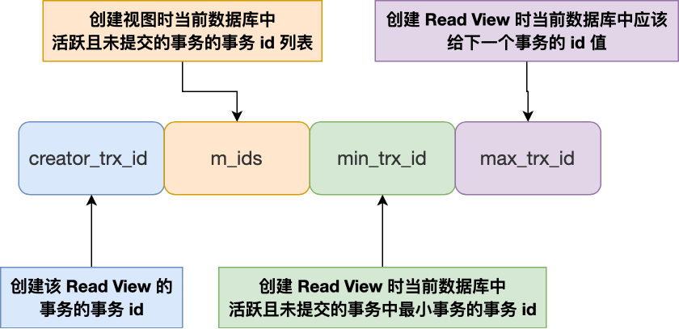
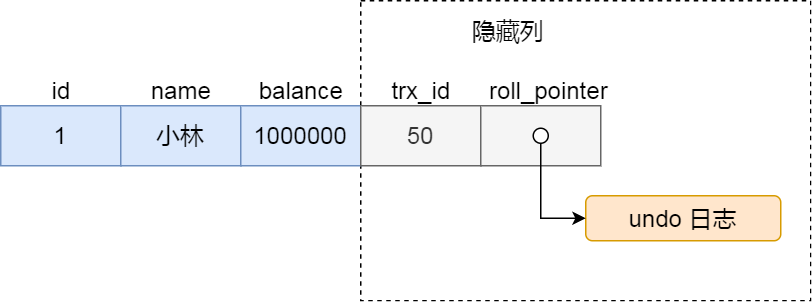

# **事务**

**起因:** 转账时, 我这边扣100, 你那边加100, 当我这边扣完, 你那边还没加, 服务器出断电, 导致我这少了100, 你那没加, 就出现了问题.

**解决办法**: **事务（*Transaction*）**

- **原子性（Atomicity）**：一个事务中的所有操作，要么全部完成，要么全部不完成，不会结束在中间某个环节，而且事务在执行过程中发生错误，会被回滚到事务开始前的状态，就像这个事务从来没有执行过一样；
- **一致性（Consistency）**：数据库的完整性不会因为事务的执行而受到破坏，比如表中有一个字段为姓名，它有唯一约束，也就是表中姓名不能重复, 高考成绩不可能为1000，如果一个事务对姓名字段进行了修改，但是在事务提交后，表中的姓名变得非唯一性了，这就破坏了事务的一致性要求，这时数据库就要撤销该事务，返回初始化的状态。
- **隔离性（Isolation）**：数据库允许多个并发事务同时对其数据进行读写和修改的能力，隔离性可以防止多个事务并发执行时由于交叉执行而导致数据的不一致。
- **持久性（Durability）**：事务处理结束后，对数据的修改就是永久的，即便系统故障也不会丢失。

**InnoDB 引擎通过什么技术来保证事务的这四个特性的呢？**

- 持久性是通过 redo log （重做日志）来保证的；
- 原子性是通过 undo log（回滚日志） 来保证的；
- 隔离性是通过 MVCC（多版本并发控制） 或锁机制来保证的；
- 一致性则是通过持久性+原子性+隔离性来保证；

### 并行事务

如果一条一条地执行事务, 就会导致一个客户端占用的情况, 其他客户端则需要**「排队」**, 因此, 引出**「并行事务」**的概念.

不难想到, 由于事务并行, 他们所读取的可能会互相影响, 因此可能会出现如下三种问题**脏读（dirty read）、不可重复读（non-repeatable read）、幻读（phantom read）**

1. **脏读: 如果一个事务「读到」了另一个「未提交事务修改过的数据」，就意味着发生了「脏读」现象.**
2. **不可重复读:在一个事务内多次读取同一个数据，如果出现前后两次读到的数据不一样的情况，就意味着发生了「不可重复读」现象**
3. **幻读:在一个事务内多次查询某个符合查询条件的「记录数量」，如果出现前后两次查询到的记录数量不一样的情况，就意味着发生了「幻读」现象**

为了解决这些问题, 就需要保证事务之间的**「隔离性」**, SQL标准提出四种隔离级别

- **读未提交（*read uncommitted*）**，指一个事务还没提交时，它做的变更就能被其他事务看到；
- **读提交（*read committed*）**，指一个事务提交之后，它做的变更才能被其他事务看到；
- **可重复读（*repeatable read*）**，指一个事务执行过程中看到的数据，一直跟这个事务启动时看到的数据是一致的，**MySQL InnoDB 引擎的默认隔离级别**；
- **串行化（*serializable* ）**；会对记录加上读写锁，在多个事务对这条记录进行读写操作时，如果发生了读写冲突的时候，后访问的事务必须等前一个事务执行完成，才能继续执行；

这四种隔离级别具体是如何实现的呢？

- 对于「读未提交」隔离级别的事务来说，因为可以读到未提交事务修改的数据，所以直接读取最新的数据就好了；
- 对于「串行化」隔离级别的事务来说，通过加读写锁的方式来避免并行访问；

- 对于「读提交」和「可重复读」隔离级别的事务来说，它们是通过 **Read View**来实现的，它们的区别在于创建 Read View 的时机不同，大家可以把 Read View 理解成一个数据快照，就像相机拍照那样，定格某一时刻的风景。**「读提交」隔离级别是在「每个语句执行前」都会重新生成一个 Read View，而「可重复读」隔离级别是「启动事务时」生成一个 Read View，然后整个事务期间都在用这个 Read View**。

> 来说, 「读提交」和 「可重复读」都是在事务执行时对数据的某一个版本进行操作, 「读提交」是操作事务每条命令时的版本(即可以读到已经提交的事务)「可重复读」是操作整个事务开始之前的版本. 

接下来详细说下，Read View 在 MVCC 里如何工作的？ 也就是怎么找到当前隔离水平对应的版本呢? 

## Read View 在 MVCC 里如何工作的？

Read View 有四个重要的字段：

- m_ids ：指的是在创建 Read View 时，当前数据库中**「活跃事务」的事务 id 列表**，注意是一个列表，**“活跃事务”指的就是，启动了但还没提交的事务**。
- min_trx_id ：指的是在创建 Read View 时，当前数据库中**「活跃事务」中事务 id 最小的事务**，也就是 m_ids 的最小值。
- max_trx_id ：这个并不是 m_ids 的最大值，而是**创建 Read View 时当前数据库中应该给下一个事务的 id 值**，也就是全局事务中最大的事务 id 值 + 1；
- creator_trx_id ：指的是**创建该 Read View 的事务的事务 id**。

聚簇索引中有两个列

* `trx_id` : 当一个事务对某条聚簇索引记录进行改动时，就会**把该事务的事务 id 记录在 trx_id 隐藏列里**；
* oll_pointer，每次对某条聚簇索引记录进行改动时，都会把旧版本的记录写入到 undo 日志中，然后**这个隐藏列是个指针，指向每一个旧版本记录**，于是就可以通过它找到修改前的记录。

重点看`min_trx_id`和`max_trx_id`和`m_ids`

**`min_trx_id` 和 `max_trx_id`之间的是暂未提交的事务id范围, m_ids是具体事务的列表**

Read View创建时, 设置好`min_trx_id`, `max_trx_id`和`m_ids`列表.

执行命令时, 比较记录的`trx_id`

* 该记录`trx_id`比Read View的`min_trx`还小, 即记录不是活跃事务的操作对象, 即当前事务**可见**
* 如果记录的 `trx_id `值大于等于 Read View 中的 `max_trx_id` 值，表示这个版本的记录是在创建 Read View **后**才启动的事务生成的，所以该版本的记录对当前事务**不可见**。
* 在这俩之间就需要查看`m_ids`列表了
  * 如果记录的 trx_id **在** `m_ids` 列表中，表示生成该版本记录的活跃事务依然活跃着（还没提交事务），所以该版本的记录对当前事务**不可见**。
  * 如果记录的 trx_id **不在** `m_ids`列表中，表示生成该版本记录的活跃事务已经被提交，所以该版本的记录对当前事务**可见**。

## Read VIew在不同隔离级别下的行为

**总的来说: 可见就可以直接读取, 不可见则根据该记录的`roll_pointer`指向之前的记录查找, 直到符合可见条件的位置, 这就是找历史版本的过程.
具体读不读取决于隔离级别, 如果是可重复读就需要找整个事务之前的历史版本, 如果是读提交就可以直接读取可见的记录**

## 幻读

> 由于可以读取历史记录, 普通读就可以避免不可重复度. 但在当前读的情况下(如`select ... for update/ delete update`等语句), 必须得读取当前记录,此时MVCC的历史版本就被忽略,  就可能出现幻读的情况, 因此, InnoDB采取加锁来防止幻读.

加锁的情况在 [lock](lock.md) 中详细说明

## Others Tips
1. 注意，执行「开始事务」命令，并不意味着启动了事务。在 MySQL 有两种开启事务的命令，分别是：

   - 第一种：begin/start transaction 命令；

   - 第二种：start transaction with consistent snapshot 命令；

   这两种开启事务的命令，事务的启动时机是不同的：

   - 执行了 begin/start transaction 命令后，并不代表事务启动了。只有在执行这个命令后，执行了增删查改操作的 SQL 语句，才是事务真正启动的时机；

   - 执行了 start transaction with consistent snapshot 命令，就会马上启动事务。
   
1. 普通Select语句 在不同隔离级别都不加锁, 在可重复读隔离级别使用MVCC(即读取历史版本)来避免问题, 此时 Select ...for update(Update, insert, delete同理, 都是读取当前的数据)会出问题, 需要加`next-key`锁

3. 事务在执行过程中所获取的锁一般在事务提交或者回滚时才会释 但是在隔离级别不大于 读提交READ COMMlTTED时，在某些情况下也会提前将一些不符合搜 条件的记录上的锁释放掉, 提高并发.