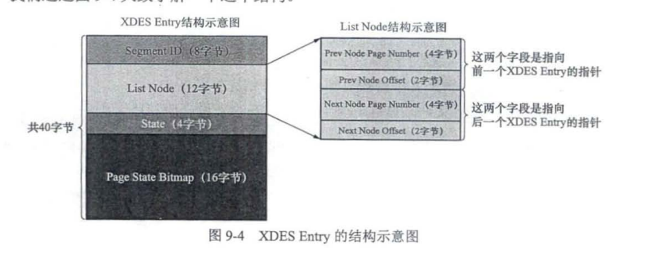
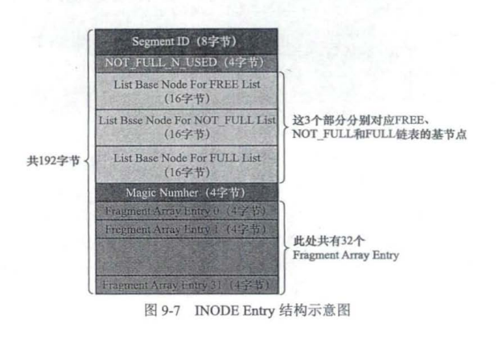
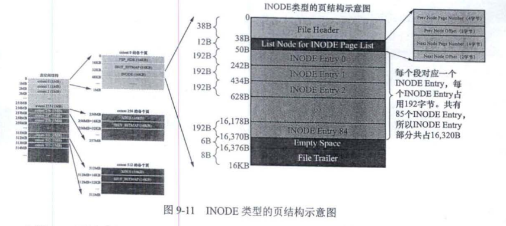

# MySQL存储的结构

* 记录: Record
* 页: Page
* 区: extent
* 组: 
* 段: Segement
* 表: Table
* 库

## 记录: Record

记录与记录之间连成**单向链表**, 便于二分查找到页面最小记录向后遍历查询.

## 页: Page

这是MySQL存储最基本的单位, 一般为16KB, 页与页之间连成**双向链表**, 便于双向查询.

## 区: Extent

对于16KB的页来说 连续的64个页就是一个区, 也就是说一个区默认占用1MB空间大小.

在表中数据量很大时, 为某个索引分配空间的时候就以区为单位分配, 甚至是一次分配多个区, 来减少磁盘I/O. **但由于数据量较小时, 这种策略会造成存储空间浪费, 因此提出了`Fragment`碎片区的概念, 直属于表空间**

### 区的分类:区有4种状态

* 空闲区 *FREE*
* 有剩余页面的碎片区: *FREE FRAG*
* 没有剩余页面的碎片区 *FREE FRAG*
* 附属于某个段的区 *FSEG*

每个区都对应一个XDES Entry结构, 这个结构记录了对应的区的一些属性

区与区之间可以通过`List Node`中的来连成一个双向链表.

**连成链表有什么特殊用处呢? 等谈到段的概念再来解释.**

## 组

每256个区被划分为一个组.组的前几页是用于管理组的, 由于页面的大小有限, `XDES Entry`结构大小为40字节, 所以才把256个区分为一组, 在每组的第一个页面存放256个`XDES Entry` 结构.

此外, 由于第一个组的第一个页面有些特殊, 它也是整个表空间的第一个页面, 因此也记录的表空间的一些属性, 为了区分命名, 将其命名为`FSP_HDR`, 含有`File Space Header`等, 其他部分与`XDES`差不多.

此外, 索引页和数据页分开在不同的区, 存放叶子节点的区的集合算是一个段, 存放非叶子节点的区的集合也算是一个段. 

## 段: Segment

段不是一个物理上的区域, 是一个逻辑上的概念,由**一些完整的区和若干零散页面组成**.

像每个区都有对应的`XDES Entry`来记录这个区的属性一样, InnoDB的设计者为每个段都定义了一个`INODE Entry`来记录这个段的属性, 方便管理段.

第一个分组中的第三个页面类型是`INODE`, 用于存储`INODE Entry`.

 

* `Segment ID`: 记录段的编号
* `NOT_FULL_N_USED`: 在`NOT_FULL`链表中已经使用了多少个页面
* 3个`List Base Node`分别为段的`FREE`,`NOT_FULL`,`FULL`链表的头节点和尾节点
* `Magic Number`: 用来标记这个INODE Entry是否已经被初始化.
* `Framgent Array Entry`: 对应一些零散的页面, 表示一些零散的页面页号.

**如何快速定位各种状态的区呢?**

前面提到各种状态的区会通过`List Node`连成链表, 通过三种`List Base Node`可以快速定位在段中各种不同状态的区的头节点, 从而快速获取需要的区来存储数据.

每一个索引都对应两个段 每个段都会维护如下个链表.

* Free 链表
* NOT_FULL 链表
* FULL链表

​	**这就可以快速定位需要的区, 使用该页面后, 页面的状态改变, 继而从该状态的链表移动到转换后状态的链表.**

如图中描述, .每个`INODE Entry` 结构占用 192 字节 个页面中可以存储 85 个这样的结构. **那如果该结构不够用了怎么办?** 

类似段中的三种区域链表, 将是否有空闲`INODE Entry`结构分成2类, 用`SEG_INODES_FULL`和`SEG_INDOE_FREE`链表连接起来, 基节点位于`FSP_HDR`类型页面的`File Space Header`中

**说到这里, 我们来总结一下共有哪些结构连成了链表吧**

* 便于表空间管理段, 第一个组中的第第一个区的第一个页面, 即`FSP_HDR`页面里头的`File Space Header` , 将每个段的`INODE`以是否有空闲的`INODE Entry`分类, 连成两条链表`SEG_INODE_FULL `和`SGE_INODE_FREE`链表.
* 便于段管理使用区, 段中的`INODE Entry`中记录了三种状态的区域的基节点, `FREE`, `NOT_FULL`和`Full`链表
* 页面之间形成双向链表
* 页面中的记录之间形成单向链表.

此外, 由于段的三种区存储空间是从表空间分配而来, 因此

* 表空间也有三种链表`FREE`, `FREE_FRAG`和`FULL_FRAG`链表, 基节点位于`FSP_HDR`页面的`File Space Header`, 便于管理分配各种区.

## Other Tips

我们知道，一个索引会产生两个段，分别是叶子节点段和非叶子节点段，而每个段都会对 应一个 `INODE`结构. **我们 怎么知道某个段对应哪个`INODE Entry`结构呢?**

索引页(INDEX页) 中有一个`Page Header`部分

其中的 PAGE BTR_SEG_LEAF PAGE_BTR_SEG_TOP 都占用 10 字节，它们其实对应一个名为 Segmen Header 的结构，如图 9- 所示.

这样就很清晰了， `Page_BTR_SEG_LEAF` 记录着叶子节点段对应的 `INODE Entry`结构的 地址是哪个表空间中哪个页丽的哪个偏移量 

`PAGE_BTR_SEG_TOP` 记录着非叶子节点段对应 `INODE Entry`结构的地址是哪个表空间中哪个页面的哪个偏移量.

这样, 索引和对应的段的关系就建立起来了. 不过需要注意的点是, 因为一个索引只对应两个段，所以只需要在索引的根页面中记录这两个结构即可.