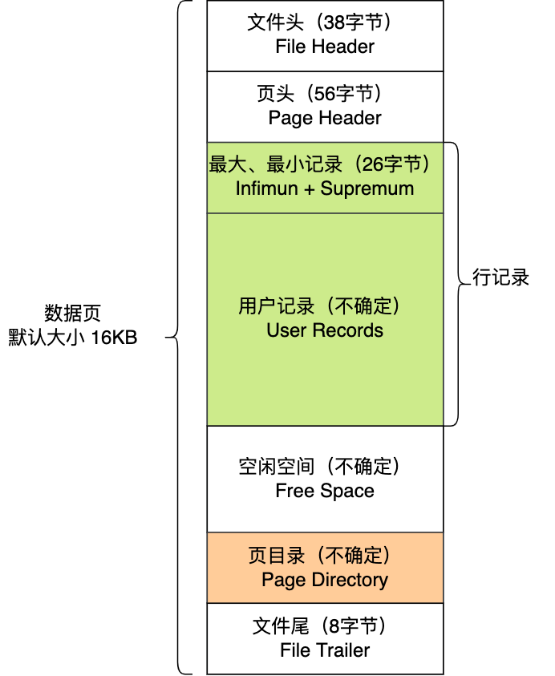

# 索引

InnoDB读写基本单位是页, 数据页结构(大致7个部分):

* `File Header`: 表示页的一些通用信息, 占固定38字节
* `Page HeadD:\blog\docs\.vuepress\nav-backUp.jser`: 表示数据页专有的一些信息, 占固定的56字节
* `lnfimum` + `Supremum` ，两个虚拟的伪记 ，分 表示页中的最小记录和最大记录，占固定的 26 字节。 
* `User Records` 真正存储我们插入的记录,大小不固定.
* `Free Space` 页中尚未使用的部分, 大小不固定. 
* `Page Directory` 页中某些记录的相对位置 ，也就是各个槽对应的记录在页面中的地址 偏移量, 大小不固定, 插入的记录越多，这个部分占用的空间就越多
* `File Trailer` 用于检验页是否完整，占固定8字节.

**每个记录的头信息中都有一个`next_record`属性, 从而可以使页中的所有记录串联成一个单向链表**. 

**每个数据页的 `File Header`都有上一个页和下一个页的编号，所以所有的数据页会组 成一个双向链表**.

lnnoDB 会把页中的记录划分为若干个组，每个组的最后一个 录的地址偏移量作为一个 槽，存放在 `Page Directory`一个槽占用8字节.在一个页中根据主键查找记录是非常快的， 分为两步.

1. 通过二分法确定该记录所在分组的槽, 并找到该槽所在分组中主键最小的那条记录
2. 通过记录的`next_record`属性遍历该槽所在组的各个记录.

**整个表的结构如下图**

在表中的查询同理

1. 在定位记录所在哪一个页时，也是通过二分法快速定位到包含该记录的页。由于B+树可能有多层, 因此这步可能不止一次查询.
2. 定位到该页后，又会在该页内进行二分法快速定位记录所在的分组（槽号），最后在分组内进行遍历查找

## 聚簇索引和二级索引

- 聚簇索引的叶子节点存放的是实际数据，所有完整的用户记录都存放在聚簇索引的叶子节点；
- 二级索引的叶子节点存放的是主键值，而不是实际数据。

InnoDB 在创建聚簇索引时，会根据不同的场景选择不同的列作为索引：

- 如果有主键，默认会使用主键作为聚簇索引的索引键；
- 如果没有主键，就选择第一个不包含 NULL 值的唯一列作为聚簇索引的索引键；
- 在上面两个都没有的情况下，InnoDB 将自动生成一个隐式自增 id 列作为聚簇索引的索引键；

一张表只能有一个聚簇索引，那为了实现非主键字段的快速搜索，就引出了二级索引（非聚簇索引/辅助索引），它也是利用了 B+ 树的数据结构，但是二级索引的叶子节点存放的是主键值，不是实际数据。

二级索引存放的''数据''只有主键值, 结构如下, 

因此如果是通过二级索引查询, 在还需要除了主键值之外的数据的情况下, 获取到主键值后, 需要回到聚簇索引的B+树查找其他需要的数据, 这个过程叫做**「回表」**.

但如果通过二级索引查询, 查询的是主键值就, 就无需回表, 直接在二级索引的表中获取即可, 这个过程叫做**「索引覆盖」**

对索引中包含的字段先做判断，过滤掉不符合条件的记录，减少回表字数,  这个过程叫做**「索引下推」**

## 为什么 MySQL 采用 B+ 树作为索引？

由于数据库需要很大容量, 又需要持久化保存. 肯定不能存放在内存, 只能放在磁盘. 因此, 为了读写效率, 除了数据结构外, 还需要从磁盘角度考虑.

* 减少磁盘I/O
* 要能高效地查询某一个记录，也要能高效地执行范围查找

磁盘读写的最小单位是**扇区**，扇区的大小只有 `512B` 大小，操作系统一次会读写多个扇区，所以**操作系统的最小读写单位是块（Block）。Linux 中的块大小为 `4KB`**，也就是一次磁盘 I/O 操作会直接读写 8 个扇区。

可考虑的数据结构有

* 哈希表
* 二分查找树
* 自平衡二叉树
* B树
* B+树

### 哈希表

哈希表在单点查询时可以做到$O(1)$的时间复杂度, 但这是无序的表, 对于查找就需要遍历整个表, 时间复杂度为$O(n)$, 而数据库对于范围查找的查询情景还是很频繁的, 因此需要寻找别的解决方案.

### 二分查找树

 二分查找树虽然是一个天然的二分结构，能很好的利用二分查找快速定位数据，但是它存在一种极端的情况，每当插入的元素都是树内最大的元素，就会导致二分查找树退化成一个链表，此时查询复杂度就会从 O(logn)降低为 O(n)。

### 自平衡二叉树

为了解决二分查找树退化成链表的问题，就出现了自平衡二叉树，保证了查询操作的时间复杂度就会一直维持在 O(logn) 。但是它本质上还是一个二叉树，每个节点只能有 2 个子节点，随着元素的增多，树的高度会越来越高。

而树的高度决定于磁盘 I/O 操作的次数，因为树是存储在磁盘中的，访问每个节点，都对应一次磁盘 I/O 操作，也就是说树的高度就等于每次查询数据时磁盘 IO 操作的次数，所以树的高度越高，就会影响查询性能。

为了减少磁盘I/O次数, 就出现了有多个子节点数的树, 即多叉树, 称为B树, B+树.

## B树

而如果同样的节点数量在平衡二叉树的场景下，树的高度就会很高，意味着磁盘 I/O 操作会更多。所以，B 树在数据查询中比平衡二叉树效率要高。

但是 B 树的每个节点都包含数据（索引+记录），而用户的记录数据的大小很有可能远远超过了索引数据，这就需要花费更多的磁盘 I/O 操作次数来读到「有用的索引数据」。

而且，在我们查询位于底层的某个节点（比如 A 记录）过程中，「非 A 记录节点」里的记录数据会从磁盘加载到内存，但是这些记录数据是没用的，我们只是想读取这些节点的索引数据来做比较查询，而「非 A 记录节点」里的记录数据对我们是没用的，这样不仅增多磁盘 I/O 操作次数，也占用内存资源。

另外，如果使用 B 树来做范围查询的话，需要使用中序遍历，这会涉及多个节点的磁盘 I/O 问题，从而导致整体速度下降。

## B+树

> B+树仅在叶子节点存放数据页, 其他都是索引页.

### 1、单点查询

B 树进行单个索引查询时，最快可以在 O(1) 的时间代价内就查到，而从平均时间代价来看，会比 B+ 树稍快一些。

但是 B 树的查询波动会比较大，因为每个节点即存索引又存记录，所以有时候访问到了非叶子节点就可以找到索引，而有时需要访问到叶子节点才能找到索引。

**B+ 树的非叶子节点不存放实际的记录数据，仅存放索引，因此数据量相同的情况下，相比存储即存索引又存记录的 B 树，B+树的非叶子节点可以存放更多的索引，因此 B+ 树可以比 B 树更「矮胖」，查询底层节点的磁盘 I/O次数会更少**。

### 2、插入和删除效率

B+ 树有大量的冗余节点，这样使得删除一个节点的时候，可以直接从叶子节点中删除，甚至可以不动非叶子节点，这样删除非常快, 一般没有复杂调整树结构的过程.

B+ 树的插入也是一样，有冗余节点，插入可能存在节点的分裂（如果节点饱和），但是最多只涉及树的一条路径。而且 B+ 树会自动平衡，不需要像更多复杂的算法，类似红黑树的旋转操作等。

###  3、范围查询

B 树和 B+ 树等值查询原理基本一致，先从根节点查找，然后对比目标数据的范围，最后递归的进入子节点查找。

因为 **B+ 树所有叶子节点间还有一个链表进行连接，这种设计对范围查找非常有帮助**，比如说我们想知道 12 月 1 日和 12 月 12 日之间的订单，这个时候可以先查找到 12 月 1 日所在的叶子节点，然后利用链表向右遍历，直到找到 12 月12 日的节点，这样就不需要从根节点查询了，进一步节省查询需要的时间。

而 B 树没有将所有叶子节点用链表串联起来的结构，因此只能通过树的遍历来完成范围查询，这会涉及多个节点的磁盘 I/O 操作，范围查询效率不如 B+ 树。

因此，存在大量范围检索的场景，适合使用 B+树，比如数据库。而对于大量的单个索引查询的场景，可以考虑 B 树，比如 nosql 的MongoDB

## 索引失效

* '%李' 对索引使用左或者左右模糊匹配
* 对索引使用函数
* 对索引进行表达式计算
* 联合索引非最左匹配
* WHERE 子句中的 OR

注: 使用左模糊不一定会走全表聚簇索引, 在仅询问二级索引和主键值的情况下, 也可能直接走全表二级索引, 因为二级索引的记录的东西少, 且不用回表, 成本更低.

同理, 如果数据库表中的字段都是索引的话，即使查询过程中，没有遵循最左匹配原则，也是走索引扫描的，而且 type 也是为 index.

## Relevant Question

1. 都知道数据库索引采⽤B+树⽽不是B树，原因也有很多，原因是什么？

   1. 主要原因：B+树只要遍历叶⼦节点就可以实现整棵树的遍历，⽽且在数据库中基于范围的查询是⾮常频繁的，⽽B 树只能中序遍历所有节点，需要读取很多页面, 也就需要很多磁盘I/O, 效率就低. 

   2. B+ Tree 查询效率更稳定: 每次都需要到叶子节点才能找到数据, 长度是相同的.
   3. 单点查询的情况下, 相同大小的B+树由于索引页含更多页面记录, 结构比B树更矮胖, 涉及更少的磁盘I/O, 因此效率更高.
   4. 插入删除的效率更高, 一般不涉及复杂的树结构变化, 仅在叶子节点插入删除.
   5. 范围查询时, 无需中序遍历, 只需要找到第一个向后遍历即可.