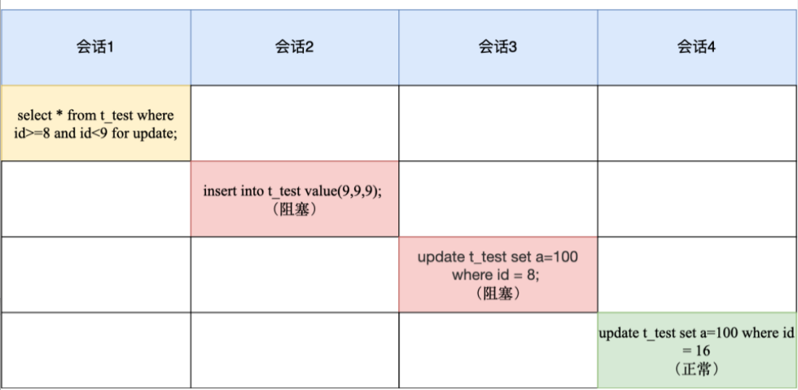
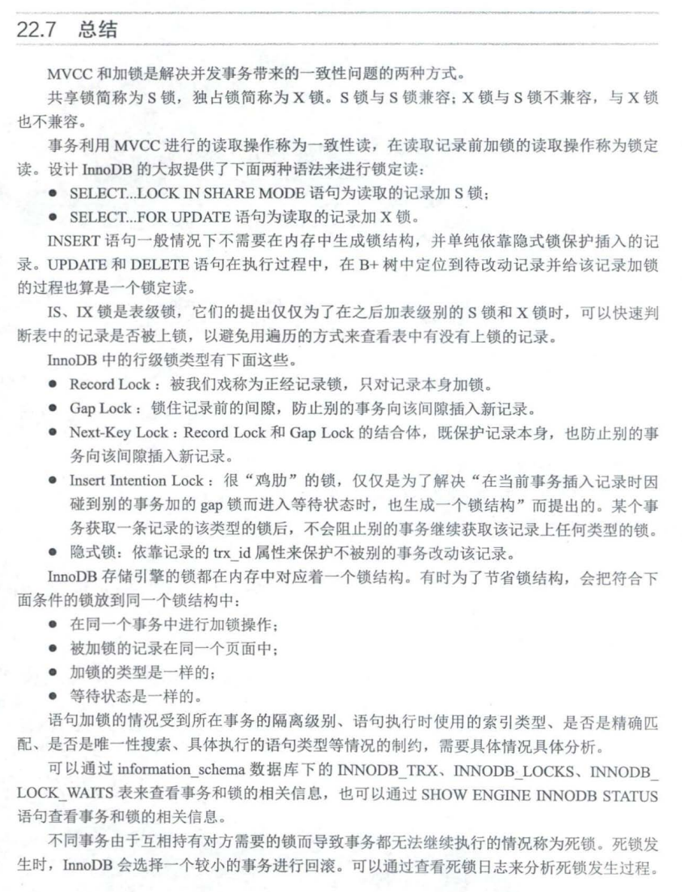

# Lock

## 类型


### 全局锁

要使用全局锁，则要执行这条命：

```mysql
flush tables with read lock
```

执行后，**整个数据库就处于只读状态了**，这时其他线程执行以下操作，都会被阻塞：

- 对数据的增删改操作，比如 insert、delete、update等语句；
- 对表结构的更改操作，比如 alter table、drop table 等语句。

如果要释放全局锁，则要执行这条命令：

```mysql
unlock tables
```

**应用场景**:  **全库逻辑备份**

备份数据库的工具是 `mysqldump`，在使用 mysqldump 时加上 `–single-transaction` 参数的时候，就会在备份数据库之前先开启事务。这种方法只适用于支持「可重复读隔离级别的事务」的存储引擎。

InnoDB 存储引擎默认的事务隔离级别正是可重复读，因此可以采用这种方式来备份数据库。

但是，对于 MyISAM 这种不支持事务的引擎，在备份数据库时就要使用全局锁的方法。


### 表级锁

> MySQL 表级锁有哪些？具体怎么用的。

MySQL 里面表级别的锁有这几种：

- 表锁；
- 元数据锁（MDL）;
- 意向锁；
- AUTO-INC 锁；

#### 表锁

先来说说**表锁**。

如果我们想对学生表（t_student）加表锁，可以使用下面的命令：

```sql
//表级别的共享锁，也就是读锁；
lock tables t_student read;

//表级别的独占锁，也就是写锁；
lock tables t_stuent wirte;
```

需要注意的是，表锁除了会限制别的线程的读写外，也会限制本线程接下来的读写操作。

也就是说如果本线程对学生表加了「共享表锁」，那么本线程接下来如果要对学生表执行写操作的语句，是会被阻塞的，当然其他线程对学生表进行写操作时也会被阻塞，直到锁被释放。

要释放表锁，可以使用下面这条命令，会释放当前会话的所有表锁：

```sql
unlock tables
```

另外，当会话退出后，也会释放所有表锁。

不过尽量避免在使用 InnoDB 引擎的表使用表锁，因为表锁的颗粒度太大，会影响并发性能，**InnoDB 牛逼的地方在于实现了颗粒度更细的行级锁**。


#### 元数据锁

再来说说**元数据锁**（MDL）。

我们不需要显示的使用 MDL，因为当我们对数据库表进行操作时，会自动给这个表加上 MDL：

- 对一张表进行 CRUD 操作时，加的是 **MDL 读锁**；
- 对一张表做结构变更操作的时候，加的是 **MDL 写锁**；

MDL 是为了保证当用户对表执行 CRUD 操作时，防止其他线程对这个表结构做了变更。

当有线程在执行 select 语句（ 加 MDL 读锁）的期间，如果有其他线程要更改该表的结构（ 申请 MDL 写锁），那么将会被阻塞，直到执行完 select 语句（ 释放 MDL 读锁）。

反之，当有线程对表结构进行变更（ 加 MDL 写锁）的期间，如果有其他线程执行了 CRUD 操作（ 申请 MDL 读锁），那么就会被阻塞，直到表结构变更完成（ 释放 MDL 写锁）。

> MDL 不需要显示调用，那它是在什么时候释放的?

MDL 是在事务提交后才会释放，这意味着**事务执行期间，MDL 是一直持有的**。

那如果数据库有一个长事务（所谓的长事务，就是开启了事务，但是一直还没提交），那在对表结构做变更操作的时候，可能会发生意想不到的事情，比如下面这个顺序的场景：

1. 首先，线程 A 先启用了事务（但是一直不提交），然后执行一条 select 语句，此时就先对该表加上 MDL 读锁；
2. 然后，线程 B 也执行了同样的 select 语句，此时并不会阻塞，因为「读读」并不冲突；
3. 接着，线程 C 修改了表字段，此时由于线程 A 的事务并没有提交，也就是 MDL 读锁还在占用着，这时线程 C 就无法申请到 MDL 写锁，就会被阻塞，

那么在线程 C 阻塞后，后续有对该表的 select 语句，就都会被阻塞，如果此时有大量该表的 select 语句的请求到来，就会有大量的线程被阻塞住，这时数据库的线程很快就会爆满了。

> 为什么线程 C 因为申请不到 MDL 写锁，而导致后续的申请读锁的查询操作也会被阻塞？

这是因为申请 MDL 锁的操作会形成一个队列，队列中**写锁获取优先级高于读锁**，一旦出现 MDL 写锁等待，会阻塞后续该表的所有 CRUD 操作。

所以为了能安全的对表结构进行变更，在对表结构变更前，先要看看数据库中的长事务，是否有事务已经对表加上了 MDL 读锁，如果可以考虑 kill 掉这个长事务，然后再做表结构的变更。


#### 意向锁

接着，说说**意向锁**。

- 在使用 InnoDB 引擎的表里对某些记录加上「共享锁」之前，需要先在表级别加上一个「意向共享锁」；
- 在使用 InnoDB 引擎的表里对某些纪录加上「独占锁」之前，需要先在表级别加上一个「意向独占锁」；

也就是，当执行插入、更新、删除操作，需要先对表加上「意向独占锁」，然后对该记录加独占锁。

而普通的 select 是不会加行级锁的，普通的 select 语句是利用 MVCC 实现一致性读，是无锁的。

不过，select 也是可以对记录加共享锁和独占锁的，具体方式如下：

```sql
//先在表上加上意向共享锁，然后对读取的记录加共享锁
select ... lock in share mode;

//先表上加上意向独占锁，然后对读取的记录加独占锁
select ... for update;
```

**意向共享锁和意向独占锁是表级锁，不会和行级的共享锁和独占锁发生冲突，而且意向锁之间也不会发生冲突，只会和共享表锁（\*lock tables ... read\*）和独占表锁（\*lock tables ... write\*）发生冲突。**

表锁和行锁是满足读读共享、读写互斥、写写互斥的。

如果没有「意向锁」，那么加「独占表锁」时，就需要遍历表里所有记录，查看是否有记录存在独占锁，这样效率会很慢。

那么有了「意向锁」，由于在对记录加独占锁前，先会加上表级别的意向独占锁，那么在加「独占表锁」时，直接查该表是否有意向独占锁，如果有就意味着表里已经有记录被加了独占锁，这样就不用去遍历表里的记录。

所以，**意向锁的目的是为了快速判断表里是否有记录被加锁**。


### AUTO-INC 锁

最后，说说 **AUTO-INC 锁**。

在为某个字段声明 `AUTO_INCREMENT` 属性时，之后可以在插入数据时，可以不指定该字段的值，数据库会自动给该字段赋值递增的值，这主要是通过 AUTO-INC 锁实现的。

AUTO-INC 锁是特殊的表锁机制，锁**不是再一个事务提交后才释放，而是再执行完插入语句后就会立即释放**。

**在插入数据时，会加一个表级别的 AUTO-INC 锁**，然后为被 `AUTO_INCREMENT` 修饰的字段赋值递增的值，等插入语句执行完成后，才会把 AUTO-INC 锁释放掉。

那么，一个事务在持有 AUTO-INC 锁的过程中，其他事务的如果要向该表插入语句都会被阻塞，从而保证插入数据时，被 `AUTO_INCREMENT` 修饰的字段的值是连续递增的。

但是， AUTO-INC 锁再对大量数据进行插入的时候，会影响插入性能，因为另一个事务中的插入会被阻塞。

因此， 在 MySQL 5.1.22 版本开始，InnoDB 存储引擎提供了一种**轻量级的锁**来实现自增。

一样也是在插入数据的时候，会为被 `AUTO_INCREMENT` 修饰的字段加上轻量级锁，**然后给该字段赋值一个自增的值，就把这个轻量级锁释放了，而不需要等待整个插入语句执行完后才释放锁**。

InnoDB 存储引擎提供了个 innodb_autoinc_lock_mode 的系统变量，是用来控制选择用 AUTO-INC 锁，还是轻量级的锁。

- 当 innodb_autoinc_lock_mode = 0，就采用 AUTO-INC 锁；
- 当 innodb_autoinc_lock_mode = 2，就采用轻量级锁；
- 当 innodb_autoinc_lock_mode = 1，这个是默认值，两种锁混着用，如果能够确定插入记录的数量就采用轻量级锁，不确定时就采用 AUTO-INC 锁。

不过，当 innodb_autoinc_lock_mode = 2 是性能最高的方式，但是会带来一定的问题。因为并发插入的存在，在每次插入时，自增长的值可能不是连续的，**这在有主从复制的场景中是不安全的**。


## 行级锁

InnoDB 引擎是支持行级锁的，而 MyISAM 引擎并不支持行级锁。

行级锁的类型主要有三类：

- Record Lock，记录锁，也就是仅仅把一条记录锁上；
- Gap Lock，间隙锁，锁定一个范围，但是不包含记录本身；
- Next-Key Lock：Record Lock + Gap Lock 的组合，锁定一个范围，并且锁定记录本身。

前面也提到，普通的 select 语句是不会对记录加锁的，如果要在查询时对记录加行锁，可以使用下面这两个方式：

```sql
//对读取的记录加共享锁
select ... lock in share mode;

//对读取的记录加独占锁
select ... for update;
```

上面这两条语句必须再一个事务中，当事务提交了，锁就会被释放，因此在使用这两条语句的时候，要加上 begin、start transaction 或者 set autocommit = 0。

那具体跟在哪些纪录上加锁，就跟具体的 select 语句有关系了，比较复杂。


## 查询时加锁

> 分析加锁的原因: 从锁住搜索区间来考虑.

###  唯一索引等值(单点)查询

>  唯一索引等值查询, 可能是聚簇索引和二级唯一索引, 

唯一索引等值查询分两种情况讨论

* 查询的记录存在, 只需加记录锁. 因为索引唯一, 只需要一条记录锁(next-key lock退化)就可以保证查询正确性.
* 查询记录不存在, 需要加间隙锁. 记录不存在, 可能会新插入该记录导致查询错误, 因此需要间隙锁(next-key lock退化).


### 唯一索引范围查询

> 要保证查询范围里头的记录不变, 因此查到没查到都需要加范围的锁(next-key或者间隙锁), 来包含住这个搜索区间, 以此保证搜索结果不变.

```mysql
select * from t_test where id>=8 and id<9 for update;
```



会话 1 加锁变化过程如下：

1. 最开始要找的第一行是 id = 8，因此 next-key lock(4,8]，但是由于 id 是唯一索引，且该记录是存在的，因此会退化成记录锁，也就是只会对 id = 8 这一行加锁；
2. 由于是范围查找，就会继续往后找存在的记录，也就是会找到 id = 16 这一行停下来，然后加 next-key lock (8, 16]，但由于 id = 16 不满足 id < 9，所以会退化成间隙锁，加锁范围变为 (8, 16)。

所以，会话 1 这时候主键索引的锁是记录锁 id=8 和间隙锁(8, 16), **包含搜索区间[8, 9], 故可以保证正确性**。

会话 2 由于往间隙锁里插入了 id = 9 的记录，所以会被锁住了，而 id = 8 是被加锁的，因此会话 3 的语句也会被阻塞。

由于 id = 16 并没有加锁，所以会话 4 是可以正常被执行。


### 非唯一索引等值查询

还是分两种情况:

* 当查询的记录存在时，除了会加 next-key lock 外，还额外加间隙锁，也就是会加两把锁。**因为索引不唯一, 所以需要延申到下一个索引处, 即加一个包含该点(点形成的索引区间)的间隙锁**
* 当查询的记录不存在时，只会加 next-key lock，然后会退化为间隙锁，也就是只会加一把锁:**即锁住这个点的索引区间即可**

**查询到的情况:**


会话 1 加锁变化过程如下：

1. 先会对普通索引 b 加上 next-key lock，范围是(4,8];
2. 然后因为是非唯一索引，且查询的记录是存在的，所以还会加上间隙锁，规则是向下遍历到第一个不符合条件的值才能停止，因此间隙锁的范围是(8,16)。

所以，会话1的普通索引 b 上共有两个锁，分别是 next-key lock (4,8] 和间隙锁 (8,16) 。**锁住了[8, 8]这个搜索区间, 保证了正确性.**

那么，当会话 2 往间隙锁里插入 id = 9 的记录就会被锁住，而会话 3 和会话 4 是因为更改了 next-key lock 范围里的记录而被锁住的。

然后因为 b = 16 这条记录没有加锁，所以会话 5 是可以正常执行的。

**未查询到: 就直接上间隙锁(由next-key退化)**


### 非唯一索引范围查询

> 非唯一索引和主键索引的范围查询的加锁也有所不同，不同之处在于**普通索引范围查询，next-key lock 不会退化为间隙锁和记录锁**


会话 1 加锁变化过程如下：

1. 最开始要找的第一行是 b = 8，因此 next-key lock(4,8]，但是由于 b 不是唯一索引，并不会退化成记录锁。
2. 但是由于是范围查找，就会继续往后找存在的记录，也就是会找到 b = 16 这一行停下来，然后加 next-key lock (8, 16]，因为是普通索引查询，所以并不会退化成间隙锁。

所以，会话 1 的普通索引 b 有两个 next-key lock，分别是 (4,8] 和(8, 16]。**即区间(4, 16], 包含搜索区间**. 这样，你就明白为什么会话 2 、会话 3 、会话 4 的语句都会被锁住了。

**注: ** 以上四种都是

1. **如果是二级索引, 还需要回表到聚簇索引给聚簇索引加相应的锁.**
2. 如果是聚簇索引, 并且更新了二级索引, 需要到相应二级索引上X锁.


为什么两边都要上锁呢?  考虑如下情况:

**二级索引到聚簇索引的情况:**

* 二级索引查询, 若仅对二级索引上锁, 第一次查到一个记录符合条件, 给二级索引上相应的锁
*  第二次查询之前, 有一个事务修改了上面符合条件的记录, 导致不符合条件.
* 第二次查询时, 就出现了问题.

**聚簇索引到二级索引的情况:**

* 根据聚簇索引更新记录, 更新了二级索引, 更新前后读到的二级索引不一致.
* 就出现了问题.


## 死锁:DeadLock


* 从③中可以看出. Tl 先对 number 值为 的聚簇索引记录加了一个 型正经记录锁 
* 从④中可以看出. T2 number 值为 的聚簇索引记录加了 型正经记录锁. 
* 从⑤中可以看出 TI 接着也想对 number 值为 的记录加 型正经记录锁，但是 与④中T2持有的锁冲突 所以 Tl 迸入阻塞状态，等待获取锁. 
* 从⑥中可以看出. T2也想对 number 值为 的记录加 型正经记录锁，但是与 T1 持有的锁冲突，所以T2迸入阻塞状态，等待获取锁.

死锁发生时 lnnoDB 会选择一个较小的事务进行回滚. 

**可以通过执行 `SHOW ENGINE INNODB STATUS` 语句来查看最近发生的一次死锁信息.**


## 总结 

>  图源:<MySQL是怎样运行的>




## 其他小知识

* 半一致性读
